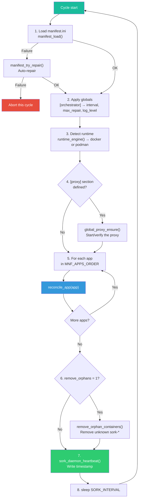
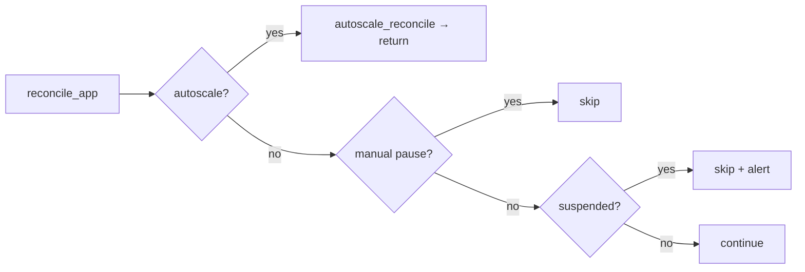
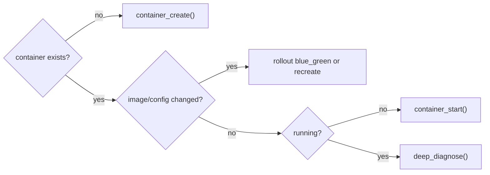
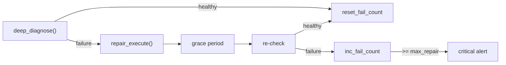
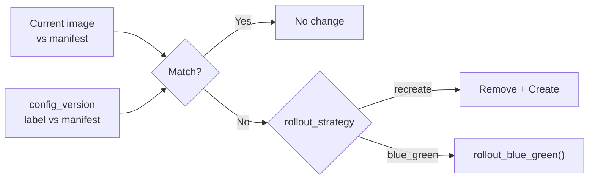
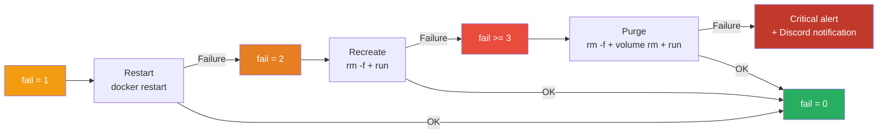
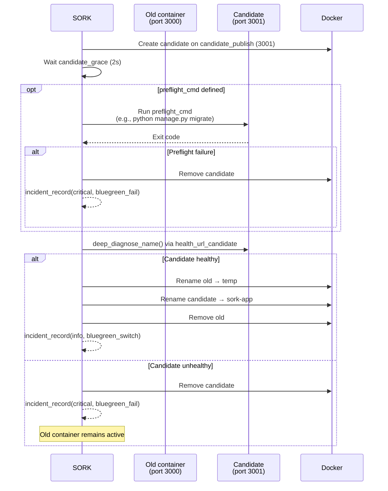

# Reconciliation Loop

The reconciliation loop continuously compares the desired state (manifest) with the actual state (Docker) and applies the necessary corrections on each cycle.

---

## Cycle Overview



### Cycle Parameters

```ini
[orchestrator]
interval = 10       # Seconds between each cycle (default: 15)
max_repair = 5      # Failures before critical alert (default: 5)
remove_orphans = 1  # Remove undeclared sork-* containers
log_level = info    # debug, info, warn, error
```

!!! info "Heartbeat"
    The file `.sork/state/sork-daemon-heartbeat` contains the timestamp of the last completed cycle. The web console uses it to display whether the daemon is active.

---

## Per-Application Reconciliation

The `reconcile_app()` function is called for each service. Here is its complete logic:

### Pre-checks



### Convergence



### Repair



---

## Revision Detection

The `ensure_desired_revision()` function checks two things:

1. **Image** — Does the container image match the manifest?
2. **config_version** — Does the `sork.config_version` label match the manifest?



Image comparison is smart: `nginx` is equivalent to `docker.io/library/nginx:latest`.

---

## Repair Strategies

### Automatic Escalation (`repair_strategy = auto`)

The `.fail` counter determines the phase:

| fail_count | Phase | Action |
|---|---|---|
| 1 | **restart** | `docker restart sork-<app>` |
| 2 | **recreate** | `docker rm -f` + `docker run` |
| 3+ | **purge** | Remove + volume deletion + `docker run` |



### Specific Strategies

```ini
repair_strategy = auto           # Full escalation (default)
repair_strategy = restart-only   # Restart only, no escalation
repair_strategy = recreate-only  # Remove + create only
repair_strategy = purge-only     # Full purge only
```

### Grace Period

```ini
post_repair_grace = 5  # Seconds to wait after repair before re-verification
```

---

## Blue/Green Deployment



Required configuration:

```ini
[mon-service]
rollout_strategy = blue_green
publish = 127.0.0.1:3000:3000
candidate_publish = 127.0.0.1:3001:3000
health_url_candidate = http://127.0.0.1:3001/health  # optional
preflight_cmd = python manage.py migrate               # optional
```

---

## Loop Protection

### Automatic Suspension

```ini
create_fail_max_attempts = 3  # Suspend after 3 creation failures
```

When creation fails N consecutive times:

1. The file `.sork/state/<app>.suspend_reconcile` is created
2. SORK stops touching this service
3. A critical alert is sent

To resume: `bin/sork resume <app>`

### Manual Pause

When an operator manually stops a container (`docker stop`), SORK detects clean shutdown exit codes:

| Exit code | Meaning |
|---|---|
| `0` | Normal shutdown |
| `137` | SIGKILL |
| `143` | SIGTERM |

SORK creates `.sork/state/<app>.manual_pause` and will not restart the container.

```ini
manual_stop_pause = 1  # Enabled by default
```

---

## Orphan Cleanup

When `remove_orphans = 1`, SORK removes containers that:

- Have a name starting with `sork-`
- Do not match any manifest section
- Are not replicas (`-r<N>`) or LB (`-lb`) of an existing service

Associated state files are also cleaned up.

---

## Execution Modes

| Command | Usage | When to use |
|---|---|---|
| `bin/sork run` | Infinite loop | Production (daemon, systemd) |
| `bin/sork once` | Single cycle | Tests, cron, first launch |
| `bin/sork reconcile-app <app>` | Single service | Targeted debugging |
