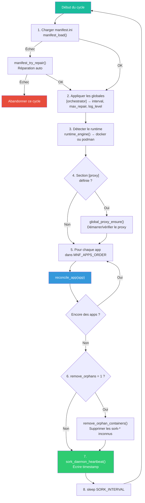
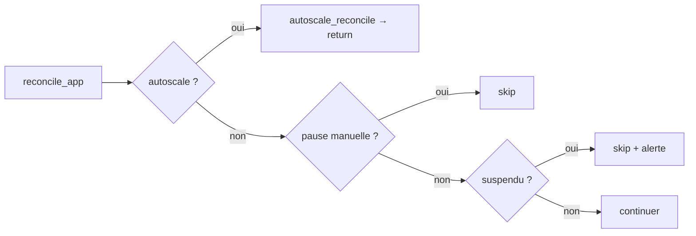
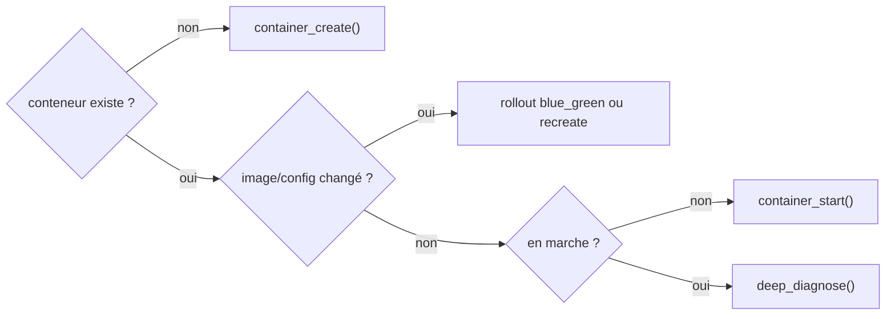
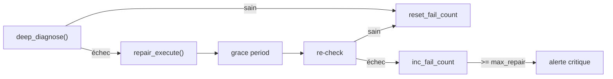
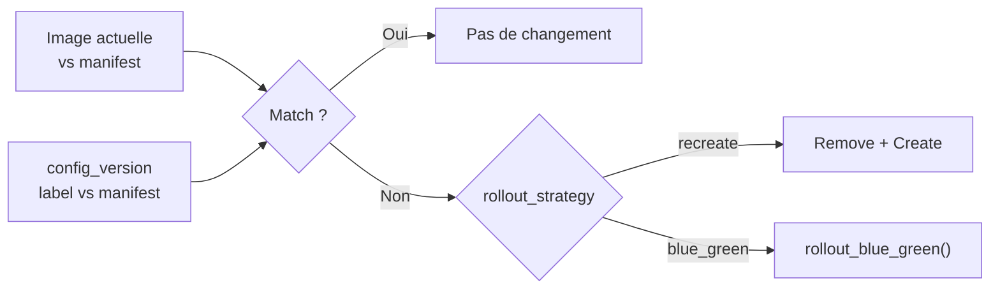
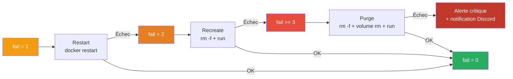
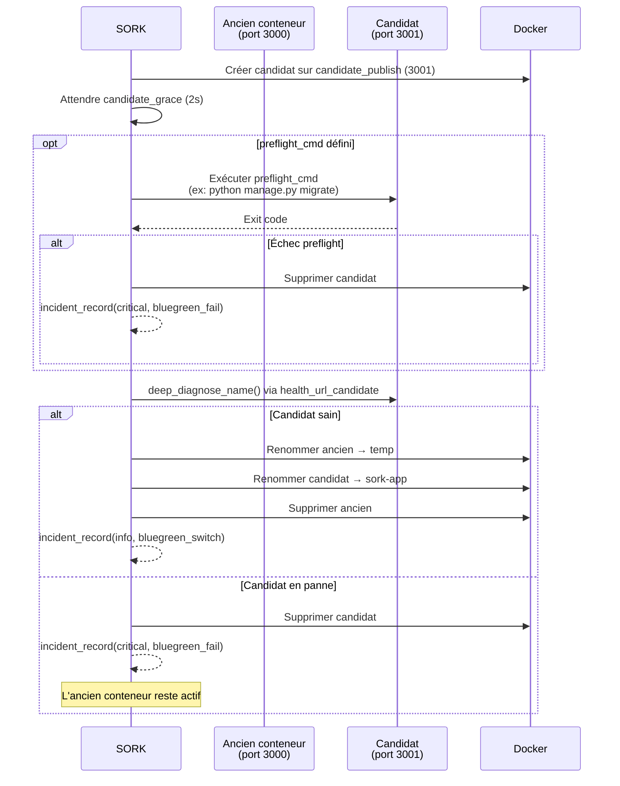

# Boucle de réconciliation

La boucle de réconciliation compare en continu l'état désiré (manifest) avec l'état réel (Docker) et applique les corrections nécessaires à chaque cycle.

---

## Vue d'ensemble du cycle



### Paramètres du cycle

```ini
[orchestrator]
interval = 10       # Secondes entre chaque cycle (défaut: 15)
max_repair = 5      # Échecs avant alerte critique (défaut: 5)
remove_orphans = 1  # Supprimer les conteneurs sork-* non déclarés
log_level = info    # debug, info, warn, error
```

!!! info "Heartbeat"
    Le fichier `.sork/state/sork-daemon-heartbeat` contient le timestamp du dernier cycle complet. La console web l'utilise pour afficher si le daemon est actif.

---

## Réconciliation par application

La fonction `reconcile_app()` est appelée pour chaque service. Voici sa logique complète :

### Pré-checks



### Convergence



### Réparation



---

## Détection de révision

La fonction `ensure_desired_revision()` vérifie deux choses :

1. **L'image** — L'image du conteneur correspond-elle au manifest ?
2. **La config_version** — Le label `sork.config_version` correspond-il au manifest ?



La comparaison d'images est intelligente : `nginx` est équivalent à `docker.io/library/nginx:latest`.

---

## Stratégies de réparation

### Escalade automatique (`repair_strategy = auto`)

Le compteur `.fail` détermine la phase :

| fail_count | Phase | Action |
|---|---|---|
| 1 | **restart** | `docker restart sork-<app>` |
| 2 | **recreate** | `docker rm -f` + `docker run` |
| 3+ | **purge** | Remove + suppression volumes + `docker run` |



### Stratégies spécifiques

```ini
repair_strategy = auto           # Escalade complète (défaut)
repair_strategy = restart-only   # Seulement restart, pas d'escalade
repair_strategy = recreate-only  # Seulement remove + create
repair_strategy = purge-only     # Seulement purge complète
```

### Grace period

```ini
post_repair_grace = 5  # Secondes d'attente après réparation avant re-vérification
```

---

## Déploiement blue/green



Configuration requise :

```ini
[mon-service]
rollout_strategy = blue_green
publish = 127.0.0.1:3000:3000
candidate_publish = 127.0.0.1:3001:3000
health_url_candidate = http://127.0.0.1:3001/health  # optionnel
preflight_cmd = python manage.py migrate               # optionnel
```

---

## Protections contre les boucles

### Suspension automatique

```ini
create_fail_max_attempts = 3  # Suspendre après 3 échecs de création
```

Quand la création échoue N fois de suite :

1. Le fichier `.sork/state/<app>.suspend_reconcile` est créé
2. SORK arrête de toucher à ce service
3. Une alerte critique est envoyée

Pour reprendre : `bin/sork resume <app>`

### Pause manuelle

Quand un opérateur arrête un conteneur manuellement (`docker stop`), SORK détecte les exit codes d'arrêt propre :

| Exit code | Signification |
|---|---|
| `0` | Arrêt normal |
| `137` | SIGKILL |
| `143` | SIGTERM |

SORK crée `.sork/state/<app>.manual_pause` et ne redémarrera pas le conteneur.

```ini
manual_stop_pause = 1  # Activé par défaut
```

---

## Nettoyage des orphelins

Quand `remove_orphans = 1`, SORK supprime les conteneurs qui :

- Ont un nom commençant par `sork-`
- Ne correspondent à aucune section du manifest
- Ne sont pas des replicas (`-r<N>`) ou LB (`-lb`) d'un service existant

Les fichiers d'état associés sont aussi nettoyés.

---

## Modes d'exécution

| Commande | Usage | Quand l'utiliser |
|---|---|---|
| `bin/sork run` | Boucle infinie | Production (daemon, systemd) |
| `bin/sork once` | Un seul cycle | Tests, cron, premier lancement |
| `bin/sork reconcile-app <app>` | Un seul service | Debug ciblé |
