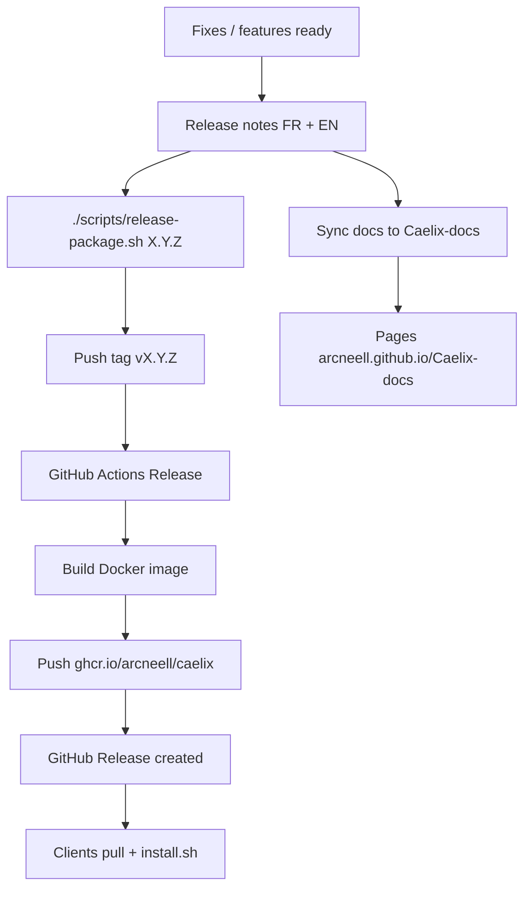

# Process — Updating the Installation Package

This guide explains **how to publish a new version** of the package your clients use to install and update Caelix.

## Client package

| Item | Value |
|------|-------|
| **Registry** | `ghcr.io` |
| **Image** | `ghcr.io/arcneell/caelix` |
| **Tags** | `:latest`, `:X.Y.Z` (semver from `VERSION`) |
| **Installer** | `install.sh` embedded in the image (`/opt/caelix/install.sh`) |

Clients **do not need the GitHub repository** — only a registry token (provided with the license) and Docker.

```bash
# Install or upgrade (same command)
echo "TOKEN" | docker login ghcr.io -u Arcneell --password-stdin
docker run --rm ghcr.io/arcneell/caelix:1.4.1 cat /opt/caelix/install.sh | bash -s -- --with-systemd
```

See [Installation](installation.en.md) for client-side details.

---

## Overview (maintainer)



---

## Prerequisites (once)

### GitHub Actions secrets (Caelix repo)

| Secret | Purpose | PAT scopes |
|--------|---------|------------|
| **`GHCR_TOKEN`** | Push image to GHCR | `write:packages`, `read:packages` |
| **`DOCS_PUSH_TOKEN`** | Sync docs to Caelix-docs | `public_repo` or fine-grained write on Caelix-docs |

Detailed setup: [Distribution & Release](distribution.en.md), [Deploy documentation](deploy.en.md).

### Local (optional `--local`)

- Docker installed
- `docker login ghcr.io` with a `write:packages` PAT

---

## Standard process (recommended — CI)

### 1. Prepare the release

- [ ] All fixes committed to `master`
- [ ] `./scripts/check-all.sh` green (or CI green)
- [ ] Choose semver number ([versioning policy](../WORKFLOW-MODIFICATIONS.md))

| Type | Example | When |
|------|---------|------|
| PATCH | `1.3.0` → `1.3.1` | Bug fixes |
| MINOR | `1.3.1` → `1.4.0` | New features |
| MAJOR | `1.4.0` → `2.0.0` | Breaking changes |

### 2. Write release notes

Create **two files** (copy previous version as a template):

- `docs/getting-started/release-notes/vX.Y.Z.md`
- `docs/getting-started/release-notes/vX.Y.Z.en.md`

Add a nav entry in `mkdocs.yml` (Getting Started section) for the new page.

### 3. Publish the package

```bash
# Bump VERSION + README + tag + CI push
./scripts/release-package.sh 1.3.1
```

Or if `VERSION` is already updated:

```bash
./scripts/release-package.sh
```

The script:

1. Runs `check-all.sh`
2. Verifies release notes exist
3. Updates `VERSION`, `README.md` badge, `main.py` (if version argument given)
4. Creates tag `vX.Y.Z` and pushes to GitHub
5. Triggers the **Release** workflow (build + GHCR push + GitHub Release)

### 4. Post-release verification

- [ ] [Release workflow](https://github.com/Arcneell/Caelix/actions/workflows/release.yml) **green**
- [ ] Image available: `docker pull ghcr.io/arcneell/caelix:X.Y.Z`
- [ ] [GitHub Release](https://github.com/Arcneell/Caelix/releases) created
- [ ] Notes online: `https://arcneell.github.io/Caelix-docs/getting-started/release-notes/vX.Y.Z/`
- [ ] Test on a clean or staging server:

```bash
docker run --rm ghcr.io/arcneell/caelix:X.Y.Z cat /opt/caelix/install.sh | bash -s -- --with-systemd
```

---

## Local publishing (fallback)

If GitHub Actions is unavailable:

```bash
docker login ghcr.io -u Arcneell
./scripts/release-package.sh --local 1.3.1
# or
./scripts/build-release.sh --push
git tag v1.3.1 && git push origin v1.3.1
```

Create the GitHub Release manually if the workflow did not run.

---

## What clients get on each update

When a client re-runs the installer (or uses `:latest`):

| Component | Behavior |
|-----------|----------|
| **Engine** (`bin/`, `lib/`) | Overwritten with new version |
| **UI image** | Re-pulled per manifest |
| **systemd** | Service updated / restarted |
| **`manifest.ini`** | **Never overwritten** |
| **`notify.ini`** | **Never overwritten** |
| **`.caelix/`** | Runtime state preserved |

Document any **new manifest keys** in release notes for manual addition.

---

## Useful commands

```bash
# Simulate without executing
./scripts/release-package.sh --dry-run 1.3.1

# Tag only (VERSION already committed)
./scripts/release-package.sh --skip-commit

# Skip check-all (emergency)
./scripts/release-package.sh --skip-checks 1.3.1

# Local build without CI
./scripts/release-package.sh --local 1.3.1
```

---

## Troubleshooting

| Error | Cause | Action |
|-------|-------|--------|
| `403 Forbidden` (GHCR) | Missing/expired `GHCR_TOKEN` | Regenerate PAT, update secret, Re-run Release |
| `Invalid username or token` (docs) | Invalid `DOCS_PUSH_TOKEN` | Regenerate PAT, Re-run Sync docs |
| Missing release notes | `.md` files absent | Create `vX.Y.Z.md` + `.en.md` |
| Tag already exists | Re-release same version | Script recreates tag; prefer PATCH bump |

---

## Related files

| File | Role |
|------|------|
| `VERSION` | Semver source of truth |
| `Dockerfile` | Distribution image build |
| `scripts/build-release.sh` | Docker build + verify + push |
| `scripts/release-package.sh` | Maintainer release orchestration |
| `scripts/install.sh` | Client installer (copied into image) |
| `.github/workflows/release.yml` | CI GHCR build + GitHub Release |
| `docs/getting-started/release-notes/` | Per-version notes |
