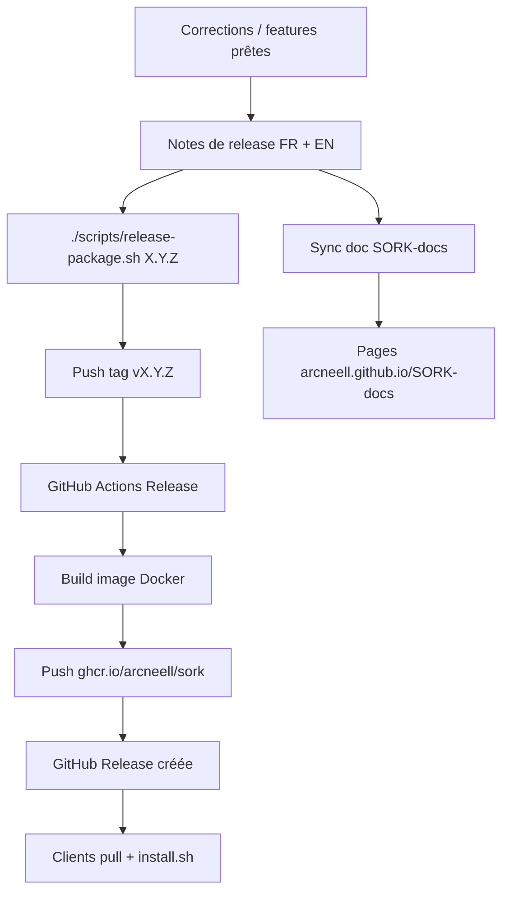

# Processus — Mise à jour du paquet d'installation

Ce guide décrit **comment publier une nouvelle version** du paquet que vos clients utilisent pour installer et mettre à jour SORK.

## Le paquet client

| Élément | Valeur |
|---------|--------|
| **Registry** | `ghcr.io` |
| **Image** | `ghcr.io/arcneell/sork` |
| **Tags** | `:latest`, `:X.Y.Z` (semver depuis `VERSION`) |
| **Installeur** | `install.sh` embarqué dans l'image (`/opt/sork/install.sh`) |

Le client **n'a pas besoin du dépôt GitHub** — seulement d'un token registry (fourni avec la licence) et de Docker.

```bash
# Installation ou mise à jour (même commande)
echo "TOKEN" | docker login ghcr.io -u Arcneell --password-stdin
docker run --rm ghcr.io/arcneell/sork:1.3.0 cat /opt/sork/install.sh | bash -s -- --with-systemd
```

Voir [Installation](installation.md) pour le détail côté client.

---

## Vue d'ensemble (maintainer)



---

## Prérequis (une fois)

### Secrets GitHub Actions (dépôt SORK)

| Secret | Usage | Scopes PAT |
|--------|-------|------------|
| **`GHCR_TOKEN`** | Push image vers GHCR | `write:packages`, `read:packages` |
| **`DOCS_PUSH_TOKEN`** | Sync doc vers SORK-docs | `public_repo` ou fine-grained write sur SORK-docs |

Configuration détaillée : [Distribution & Release](distribution.md), [Déploiement doc](deploy.md).

### En local (option `--local`)

- Docker installé
- `docker login ghcr.io` avec un PAT `write:packages`

---

## Processus standard (recommandé — CI)

### 1. Préparer la release

- [ ] Tous les correctifs commités sur `master`
- [ ] `./scripts/check-all.sh` vert (ou CI verte)
- [ ] Décider du numéro semver ([politique de version](../WORKFLOW-MODIFICATIONS.md))

| Type | Exemple | Quand |
|------|---------|-------|
| PATCH | `1.3.0` → `1.3.1` | Bug fixes |
| MINOR | `1.3.1` → `1.4.0` | Nouvelles features |
| MAJOR | `1.4.0` → `2.0.0` | Breaking changes |

### 2. Rédiger les notes de release

Créer **deux fichiers** (copier la version précédente comme base) :

- `docs/getting-started/release-notes/vX.Y.Z.md`
- `docs/getting-started/release-notes/vX.Y.Z.en.md`

Ajouter l'entrée dans `mkdocs.yml` (section Démarrage) si nouvelle page.

### 3. Publier le paquet

```bash
# Bump VERSION + README + tag + push CI
./scripts/release-package.sh 1.3.1
```

Ou si `VERSION` est déjà à jour :

```bash
./scripts/release-package.sh
```

Le script :

1. Lance `check-all.sh`
2. Vérifie que les notes de release existent
3. Met à jour `VERSION`, badge `README.md`, `main.py` (si version passée)
4. Crée le tag `vX.Y.Z` et pousse sur GitHub
5. Déclenche le workflow **Release** (build + push GHCR + GitHub Release)

### 4. Vérifier post-release

- [ ] [Workflow Release](https://github.com/Arcneell/SORK/actions/workflows/release.yml) **vert**
- [ ] Image disponible : `docker pull ghcr.io/arcneell/sork:X.Y.Z`
- [ ] [GitHub Release](https://github.com/Arcneell/SORK/releases) créée
- [ ] Notes en ligne : `https://arcneell.github.io/SORK-docs/getting-started/release-notes/vX.Y.Z/`
- [ ] Test sur serveur vierge ou de staging :

```bash
docker run --rm ghcr.io/arcneell/sork:X.Y.Z cat /opt/sork/install.sh | bash -s -- --with-systemd
```

---

## Publication locale (secours)

Si GitHub Actions est indisponible :

```bash
docker login ghcr.io -u Arcneell
./scripts/release-package.sh --local 1.3.1
# ou
./scripts/build-release.sh --push
git tag v1.3.1 && git push origin v1.3.1
```

Créer la GitHub Release manuellement si le workflow n'a pas tourné.

---

## Ce que reçoit le client à chaque mise à jour

Quand un client relance l'installeur (ou `:latest`) :

| Composant | Comportement |
|-----------|--------------|
| **Moteur** (`bin/`, `lib/`) | Écrasé avec la nouvelle version |
| **Image UI** | Re-pullée depuis le manifest |
| **systemd** | Service mis à jour / redémarré |
| **`manifest.ini`** | **Jamais écrasé** |
| **`notify.ini`** | **Jamais écrasé** |
| **`.sork/`** | État runtime conservé |

Documenter dans les notes de release toute **nouvelle clé manifeste** à ajouter manuellement.

---

## Commandes utiles

```bash
# Simuler sans exécuter
./scripts/release-package.sh --dry-run 1.3.1

# Tag seul (VERSION déjà commitée)
./scripts/release-package.sh --skip-commit

# Ignorer check-all (urgence)
./scripts/release-package.sh --skip-checks 1.3.1

# Build local sans CI
./scripts/release-package.sh --local 1.3.1
```

---

## Dépannage

| Erreur | Cause | Action |
|--------|-------|--------|
| `403 Forbidden` (GHCR) | `GHCR_TOKEN` manquant/expiré | Regénérer PAT, mettre à jour secret, Re-run Release |
| `Invalid username or token` (doc) | `DOCS_PUSH_TOKEN` invalide | Regénérer PAT, Re-run Sync docs |
| Notes de release manquantes | Fichiers `.md` absents | Créer `vX.Y.Z.md` + `.en.md` |
| Tag déjà existant | Re-release même version | Le script recrée le tag ; préférer bump PATCH |

---

## Fichiers concernés

| Fichier | Rôle |
|---------|------|
| `VERSION` | Version semver source de vérité |
| `Dockerfile` | Build image distribution |
| `scripts/build-release.sh` | Build + vérif + push Docker |
| `scripts/release-package.sh` | Orchestration release maintainer |
| `scripts/install.sh` | Installeur client (copié dans l'image) |
| `.github/workflows/release.yml` | CI build GHCR + GitHub Release |
| `docs/getting-started/release-notes/` | Notes par version |
