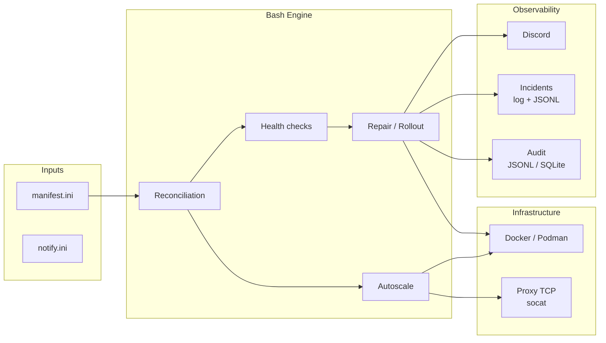

# Caelix — Self-healing Docker orchestration

<p align="center">
  
</p>

<p align="center"><strong>Single-node Docker orchestrator in Bash</strong></p>

---

## Overview

Caelix is a declarative orchestrator for Docker containers on a single server. Services are defined in an INI file. The engine ensures convergence toward the desired state through a continuous reconciliation loop.

**Key capabilities:**

- Declarative reconciliation with drift detection
- Health checks: HTTP, TCP, memory, OOM, latency, error rate, logs, disk
- Automatic repair through escalation (restart → recreate → purge)
- Blue/green deployment with pre-switch validation
- Horizontal autoscaling with built-in TCP load balancer (socat)
- Discord alerts with detailed diagnostics
- Audit trail in JSONL or SQLite
- Web console: Vue 3 + FastAPI (150+ REST endpoints, httpOnly cookie auth)

---

## Architecture



---

## Tech Stack

| Component | Technology |
|---|---|
| Engine | Bash 5, curl, Docker/Podman |
| Proxy | socat (TCP round-robin, hot-reload) |
| UI Backend | Python 3.11+, FastAPI, SSE |
| UI Frontend | Vue 3, TypeScript, Tailwind CSS, Vite |
| Notifications | Discord webhooks |
| Audit | JSONL or SQLite |

---

## Project Structure

```
caelix/
├── bin/caelix                    # CLI (9 commands)
├── lib/                        # Bash engine
│   ├── common.sh               #   Logging, state management, port allocation
│   ├── manifest.sh             #   INI parser
│   ├── runtime.sh              #   Docker/Podman abstraction
│   ├── health.sh               #   8 types of health checks
│   ├── repair.sh               #   Repair escalation, blue/green
│   ├── autoscale.sh            #   Replica management, metrics, decisions
│   ├── proxy.sh                #   TCP reverse proxy
│   ├── notify.sh               #   Discord notifications
│   ├── incidents.sh            #   Incident journal
│   ├── audit.sh                #   Bash audit hook
│   ├── doctor.sh               #   Validation and diagnostics
│   ├── audit_log.py            #   JSONL/SQLite persistence
│   └── manifest_doctor.py      #   Advanced Python validation
├── etc/                        # Configuration
│   ├── manifest.ini            #   Declared services
│   └── notify.ini              #   Discord webhook
├── ui/                         # Web console
│   ├── backend/                #   FastAPI (21 routers, 150+ endpoints)
│   ├── frontend/               #   Vue 3 SPA
│   └── Dockerfile              #   Multi-stage build
├── scripts/                    # Installation and maintenance
├── .caelix/                      # Runtime data
├── caelix.global.service         # systemd unit
└── VERSION                     # 1.4.1
```

---

## Quickstart

=== "Automatic installation"

    ```bash
    git clone https://github.com/Arcneell/Caelix.git
    cd Caelix
    ./scripts/install-all.sh
    ```

=== "Manual installation"

    ```bash
    git clone https://github.com/Arcneell/Caelix.git
    cd Caelix
    cp etc/manifest.ini.example etc/manifest.ini
    cp etc/notify.ini.example etc/notify.ini
    bin/caelix validate
    bin/caelix run
    ```

:material-arrow-right: [Full installation guide](getting-started/installation.md)

---

## Table of Contents

| Section | Content |
|---|---|
| [Getting Started](getting-started/installation.md) | Installation, first launch, documentation deployment |
| [Architecture](architecture/overview.md) | Components, reconciliation flow, state directory |
| [Configuration](configuration/manifest.md) | INI manifest, Discord notifications, environment variables |
| [Modules](modules/health.md) | Health, repair, autoscale, proxy, audit, incidents, notifications |
| [Web Console](ui/overview.md) | UI, REST API, frontend |
| [Reference](reference/cli.md) | CLI, exhaustive configuration, internal functions, troubleshooting |
