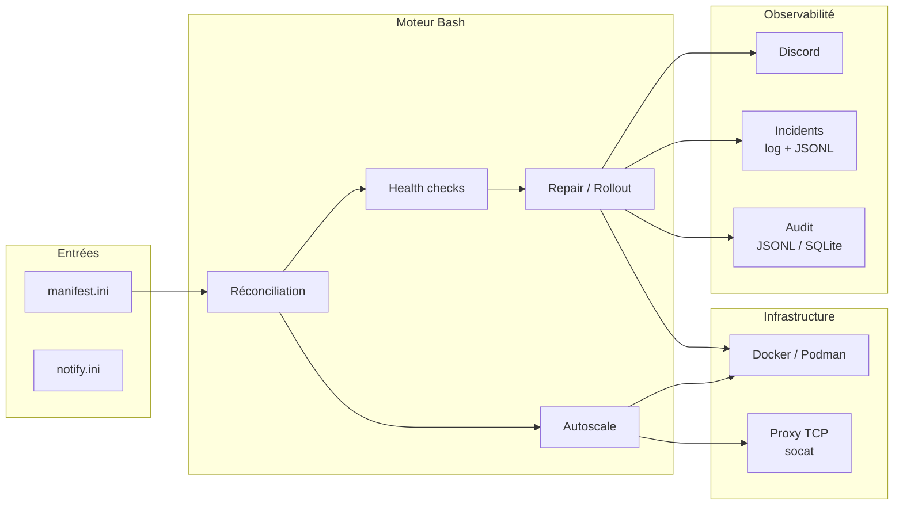

# Caelix — Orchestration Docker auto-réparatrice

<p align="center">
  
</p>

<p align="center"><strong>Orchestrateur Docker single-node en Bash</strong></p>

---

## Présentation

Caelix est un orchestrateur déclaratif pour conteneurs Docker sur un seul serveur. Les services sont définis dans un fichier INI. Le moteur assure la convergence vers l'état désiré via une boucle de réconciliation continue.

**Capacités principales :**

- Réconciliation déclarative avec détection d'écarts
- Health checks HTTP, TCP, mémoire, OOM, latence, error rate, logs, disque
- Réparation automatique par escalade (restart → recreate → purge)
- Déploiement blue/green avec validation pré-bascule
- Autoscaling horizontal avec load balancer TCP intégré (socat)
- Alertes Discord avec diagnostic détaillé
- Audit trail JSONL ou SQLite
- Console web Vue 3 + FastAPI (150+ endpoints REST, auth par cookie httpOnly)

---

## Architecture



---

## Stack technique

| Composant | Technologie |
|---|---|
| Moteur | Bash 5, curl, Docker/Podman |
| Proxy | socat (TCP round-robin, hot-reload) |
| Backend UI | Python 3.11+, FastAPI, SSE |
| Frontend UI | Vue 3, TypeScript, Tailwind CSS, Vite |
| Notifications | Discord webhooks |
| Audit | JSONL ou SQLite |

---

## Structure du projet

```
caelix/
├── bin/caelix                    # CLI (9 commandes)
├── lib/                        # Moteur Bash
│   ├── common.sh               #   Logging, gestion d'état, allocation de ports
│   ├── manifest.sh             #   Parseur INI
│   ├── runtime.sh              #   Abstraction Docker/Podman
│   ├── health.sh               #   8 types de health checks
│   ├── repair.sh               #   Escalade de réparation, blue/green
│   ├── autoscale.sh            #   Gestion de replicas, métriques, décisions
│   ├── proxy.sh                #   Reverse-proxy TCP
│   ├── notify.sh               #   Notifications Discord
│   ├── incidents.sh            #   Journal d'incidents
│   ├── audit.sh                #   Hook d'audit Bash
│   ├── doctor.sh               #   Validation et diagnostic
│   ├── audit_log.py            #   Persistence JSONL/SQLite
│   └── manifest_doctor.py      #   Validation avancée Python
├── etc/                        # Configuration
│   ├── manifest.ini            #   Services déclarés
│   └── notify.ini              #   Webhook Discord
├── ui/                         # Console web
│   ├── backend/                #   FastAPI (21 routers, 150+ endpoints)
│   ├── frontend/               #   Vue 3 SPA
│   └── Dockerfile              #   Multi-stage build
├── scripts/                    # Installation et maintenance
├── .caelix/                      # Données runtime
├── caelix.global.service         # Unit systemd
└── VERSION                     # 1.4.1
```

---

## Quickstart

=== "Installation automatique"

    ```bash
    git clone https://github.com/Arcneell/Caelix.git
    cd Caelix
    ./scripts/install-all.sh
    ```

=== "Installation manuelle"

    ```bash
    git clone https://github.com/Arcneell/Caelix.git
    cd Caelix
    cp etc/manifest.ini.example etc/manifest.ini
    cp etc/notify.ini.example etc/notify.ini
    bin/caelix validate
    bin/caelix run
    ```

:material-arrow-right: [Guide d'installation complet](getting-started/installation.md)

---

## Sommaire

| Section | Contenu |
|---|---|
| [Démarrage](getting-started/installation.md) | Installation, premier lancement, déploiement de la doc |
| [Architecture](architecture/overview.md) | Composants, flux de réconciliation, répertoire d'état |
| [Configuration](configuration/manifest.md) | Manifest INI, notifications Discord, variables d'environnement |
| [Modules](modules/health.md) | Health, repair, autoscale, proxy, audit, incidents, notifications |
| [Console Web](ui/overview.md) | UI, API REST, frontend |
| [Référence](reference/cli.md) | CLI, configuration exhaustive, fonctions internes, troubleshooting |
