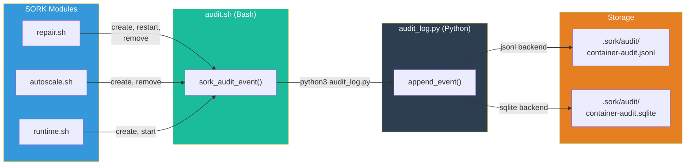

# Audit

The `audit.sh` + `audit_log.py` module records an audit trail of all container operations (create, start, stop, restart, remove) for traceability.

---

## Overview



---

## Activation

### Per Service

```ini
[mon-service]
container_audit_log = 1
```

### Global (all sork-* containers)

```ini
[orchestrator]
audit_log_all = 1
```

The `should_record()` function in `audit_log.py` checks `audit_log_all` then `container_audit_log` to decide whether an event should be recorded.

---

## Storage Backends

### JSONL (default)

```ini
[orchestrator]
audit_log_backend = jsonl
```

File: `.sork/audit/container-audit.jsonl`

Each event is a JSON object on a single line:

```json
{"ts":"2025-01-15T10:30:00Z","app":"web","container":"sork-web","event":"create","source":"reconcile","detail":"image=nginx:latest"}
{"ts":"2025-01-15T10:30:05Z","app":"web","container":"sork-web","event":"start","source":"reconcile","detail":""}
{"ts":"2025-01-15T11:00:00Z","app":"web","container":"sork-web","event":"restart","source":"repair","detail":"health_fail_count=3"}
```

**Advantages:** simple, append-only, easy to parse with `jq`.

### SQLite

```ini
[orchestrator]
audit_log_backend = sqlite
```

File: `.sork/audit/container-audit.sqlite`

Schema:

```sql
CREATE TABLE audit_events (
    id INTEGER PRIMARY KEY AUTOINCREMENT,
    ts TEXT,        -- ISO UTC timestamp
    app TEXT,       -- Service name
    container TEXT, -- Container name
    event TEXT,     -- Event type
    source TEXT,    -- Action origin
    detail TEXT     -- Additional details
);
```

**Advantages:** powerful SQL queries, filtering, aggregation.

#### Query Examples

```bash
# Last 10 events
sqlite3 .sork/audit/container-audit.sqlite \
  "SELECT ts, app, event, detail FROM audit_events ORDER BY id DESC LIMIT 10;"

# Events by type for a service
sqlite3 .sork/audit/container-audit.sqlite \
  "SELECT event, COUNT(*) as n FROM audit_events WHERE app='web' GROUP BY event ORDER BY n DESC;"

# Incident timeline (between two dates)
sqlite3 .sork/audit/container-audit.sqlite \
  "SELECT ts, event, source, detail FROM audit_events
   WHERE app='api' AND ts BETWEEN '2025-01-15T10:00:00' AND '2025-01-15T12:00:00'
   ORDER BY ts;"

# Most repaired services
sqlite3 .sork/audit/container-audit.sqlite \
  "SELECT app, COUNT(*) as repairs FROM audit_events
   WHERE event='restart' GROUP BY app ORDER BY repairs DESC;"
```

---

## Recorded Events

| Event | Description | Typical Source |
|---|---|---|
| `create` | Container created via `docker run` | `reconcile`, `autoscale` |
| `start` | Container started via `docker start` | `reconcile` |
| `stop` | Container stopped | `user` |
| `restart` | Container restarted via `docker restart` | `repair` |
| `remove` | Container removed via `docker rm -f` | `reconcile`, `repair`, `orphan_cleanup` |

---

## Technical Architecture

### Bash Layer (`lib/audit.sh`)

The `sork_audit_event()` function is the hook called by other modules:

```bash
sork_audit_event "$app" "$cname" "$event" "$source" "$detail"
# Example:
sork_audit_event "web" "sork-web" "create" "reconcile" "image=nginx:latest"
```

It locates `audit_log.py` via `sork_audit_py()` and calls it with python3. If python3 is not available, auditing is silently disabled.

### Python Layer (`lib/audit_log.py`)

The Python script handles persistence. It offers three CLI subcommands:

```bash
# Record an event
python3 audit_log.py append <manifest_path> <data_dir> <app> <container> <event> <source> [detail]

# Read recent events
python3 audit_log.py recent <manifest_path> <data_dir> [--limit N]

# Clear logs
python3 audit_log.py clear <data_dir>
```

#### Python Functions

| Function | Description |
|---|---|
| `should_record(manifest, app)` | Should this service be audited? |
| `backend_for(manifest)` | Which backend to use? (jsonl/sqlite) |
| `append_jsonl(path, record)` | Append a record to JSONL |
| `append_sqlite(path, record)` | Insert into SQLite |
| `append_event(...)` | Unified entry point |
| `_read_jsonl_tail_records(path, limit)` | Read the last N records from JSONL (efficient backward seek) |
| `read_recent(manifest, data_dir, limit)` | Read recent events (max 500) |
| `clear_audit_storage(data_dir)` | Delete all logs |

---

## Viewing via the Web Console

The **Orchestrator > Audit Journal** section offers:

- Filterable table by service, event, date
- Visual operation timeline
- Data export

REST API:

| Method | Endpoint | Description |
|---|---|---|
| `GET` | `/api/audit/recent?limit=50` | Recent events |
| `POST` | `/api/audit/clear` | Clear logs |

---

## Command-Line Viewing

```bash
# JSONL: last events with jq
tail -20 .sork/audit/container-audit.jsonl | jq .

# JSONL: filter by service
cat .sork/audit/container-audit.jsonl | jq 'select(.app=="web")'

# SQLite: direct query
sqlite3 .sork/audit/container-audit.sqlite "SELECT * FROM audit_events ORDER BY id DESC LIMIT 20;"

# Via the Python script
python3 lib/audit_log.py recent etc/manifest.ini .sork --limit 50
```
