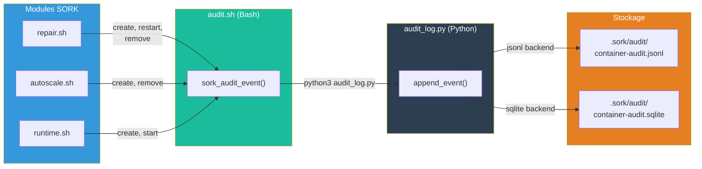

# Audit

Le module `audit.sh` + `audit_log.py` enregistre un audit trail de toutes les opérations conteneur (create, start, stop, restart, remove) pour la traçabilité.

---

## Vue d'ensemble



---

## Activation

### Par service

```ini
[mon-service]
container_audit_log = 1
```

### Global (tous les conteneurs sork-*)

```ini
[orchestrator]
audit_log_all = 1
```

La fonction `should_record()` dans `audit_log.py` vérifie `audit_log_all` puis `container_audit_log` pour décider si un événement doit être enregistré.

---

## Backends de stockage

### JSONL (défaut)

```ini
[orchestrator]
audit_log_backend = jsonl
```

Fichier : `.sork/audit/container-audit.jsonl`

Chaque événement est un JSON sur une ligne :

```json
{"ts":"2025-01-15T10:30:00Z","app":"web","container":"sork-web","event":"create","source":"reconcile","detail":"image=nginx:latest"}
{"ts":"2025-01-15T10:30:05Z","app":"web","container":"sork-web","event":"start","source":"reconcile","detail":""}
{"ts":"2025-01-15T11:00:00Z","app":"web","container":"sork-web","event":"restart","source":"repair","detail":"health_fail_count=3"}
```

**Avantages :** simple, append-only, facile à parser avec `jq`.

### SQLite

```ini
[orchestrator]
audit_log_backend = sqlite
```

Fichier : `.sork/audit/container-audit.sqlite`

Schéma :

```sql
CREATE TABLE audit_events (
    id INTEGER PRIMARY KEY AUTOINCREMENT,
    ts TEXT,        -- Timestamp ISO UTC
    app TEXT,       -- Nom du service
    container TEXT, -- Nom du conteneur
    event TEXT,     -- Type d'événement
    source TEXT,    -- Origine de l'action
    detail TEXT     -- Détails supplémentaires
);
```

**Avantages :** requêtes SQL puissantes, filtrage, agrégation.

#### Exemples de requêtes

```bash
# 10 derniers événements
sqlite3 .sork/audit/container-audit.sqlite \
  "SELECT ts, app, event, detail FROM audit_events ORDER BY id DESC LIMIT 10;"

# Événements par type pour un service
sqlite3 .sork/audit/container-audit.sqlite \
  "SELECT event, COUNT(*) as n FROM audit_events WHERE app='web' GROUP BY event ORDER BY n DESC;"

# Timeline d'un incident (entre deux dates)
sqlite3 .sork/audit/container-audit.sqlite \
  "SELECT ts, event, source, detail FROM audit_events
   WHERE app='api' AND ts BETWEEN '2025-01-15T10:00:00' AND '2025-01-15T12:00:00'
   ORDER BY ts;"

# Services les plus réparés
sqlite3 .sork/audit/container-audit.sqlite \
  "SELECT app, COUNT(*) as repairs FROM audit_events
   WHERE event='restart' GROUP BY app ORDER BY repairs DESC;"
```

---

## Événements enregistrés

| Événement | Description | Source typique |
|---|---|---|
| `create` | Conteneur créé via `docker run` | `reconcile`, `autoscale` |
| `start` | Conteneur démarré via `docker start` | `reconcile` |
| `stop` | Conteneur arrêté | `user` |
| `restart` | Conteneur redémarré via `docker restart` | `repair` |
| `remove` | Conteneur supprimé via `docker rm -f` | `reconcile`, `repair`, `orphan_cleanup` |

---

## Architecture technique

### Couche Bash (`lib/audit.sh`)

La fonction `sork_audit_event()` est le hook appelé par les autres modules :

```bash
sork_audit_event "$app" "$cname" "$event" "$source" "$detail"
# Exemple :
sork_audit_event "web" "sork-web" "create" "reconcile" "image=nginx:latest"
```

Elle localise `audit_log.py` via `sork_audit_py()` et l'appelle avec python3. Si python3 n'est pas disponible, l'audit est silencieusement désactivé.

### Couche Python (`lib/audit_log.py`)

Le script Python gère la persistence. Il offre trois sous-commandes CLI :

```bash
# Enregistrer un événement
python3 audit_log.py append <manifest_path> <data_dir> <app> <container> <event> <source> [detail]

# Lire les événements récents
python3 audit_log.py recent <manifest_path> <data_dir> [--limit N]

# Effacer les logs
python3 audit_log.py clear <data_dir>
```

#### Fonctions Python

| Fonction | Description |
|---|---|
| `should_record(manifest, app)` | Doit-on auditer ce service ? |
| `backend_for(manifest)` | Quel backend utiliser ? (jsonl/sqlite) |
| `append_jsonl(path, record)` | Ajoute un record au JSONL |
| `append_sqlite(path, record)` | Insère dans SQLite |
| `append_event(...)` | Point d'entrée unifié |
| `_read_jsonl_tail_records(path, limit)` | Lit les N derniers records JSONL (seek arrière efficace) |
| `read_recent(manifest, data_dir, limit)` | Lit les événements récents (max 500) |
| `clear_audit_storage(data_dir)` | Supprime tous les logs |

---

## Consultation via la console web

La section **Orchestrator > Audit Journal** offre :

- Tableau filtrable par service, événement, date
- Timeline visuelle des opérations
- Export des données

API REST :

| Méthode | Endpoint | Description |
|---|---|---|
| `GET` | `/api/audit/recent?limit=50` | Événements récents |
| `POST` | `/api/audit/clear` | Effacer les logs |

---

## Consultation en ligne de commande

```bash
# JSONL : derniers événements avec jq
tail -20 .sork/audit/container-audit.jsonl | jq .

# JSONL : filtrer par service
cat .sork/audit/container-audit.jsonl | jq 'select(.app=="web")'

# SQLite : requête directe
sqlite3 .sork/audit/container-audit.sqlite "SELECT * FROM audit_events ORDER BY id DESC LIMIT 20;"

# Via le script Python
python3 lib/audit_log.py recent etc/manifest.ini .sork --limit 50
```
