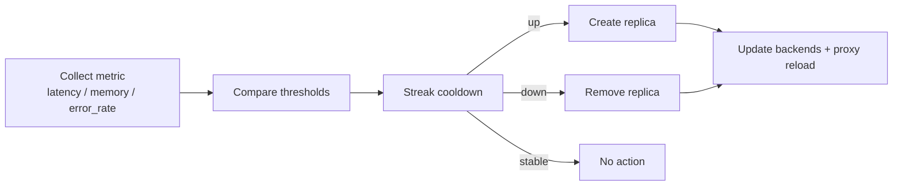
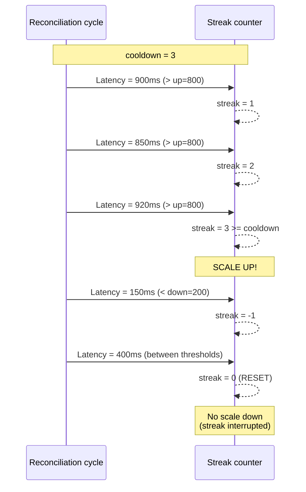
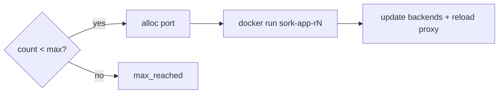
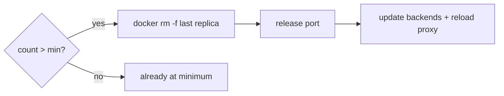

# Autoscale

The `autoscale.sh` module implements horizontal scaling: replica management, metric collection, scaling decisions with cooldown, and built-in load balancer control.

---

## Overview



---

## Activation

```ini
[mon-service]
autoscale = 1                    # Enable autoscaling
autoscale_min = 2                # Minimum replicas
autoscale_max = 6                # Maximum replicas
autoscale_container_port = 8080  # Internal port for replicas
```

When `autoscale = 1`, SORK does not create a single `sork-<app>` container but instead manages replicas `sork-<app>-r1`, `sork-<app>-r2`, etc. behind a load balancer.

---

## Replica Management

### Naming and Labels

| Element | Convention | Example |
|---|---|---|
| Container | `sork-<app>-r<N>` | `sork-web-r1`, `sork-web-r2` |
| App label | `sork.app=<app>` | `sork.app=web` |
| Role label | `sork.role=replica` | — |
| Index label | `sork.replica=<N>` | `sork.replica=3` |

### Port Allocation

Each replica needs a unique host port to expose its service.

=== "Explicit mode"

    ```ini
    autoscale_port_base = 18500
    # Replica 1 → 18500
    # Replica 2 → 18501
    # Replica 3 → 18502
    ```

=== "Automatic mode"

    ```ini
    [proxy]
    autoscale_port_range = 18500-18999
    # SORK allocates the next free port in the range
    ```

Allocation is persisted in `.sork/autoscale/port_allocations` with a `flock` lock for atomicity.

**Involved functions:**

| Function | Description |
|---|---|
| `port_alloc_init()` | Initialize the allocation file |
| `port_alloc_get(app, idx)` | Retrieve an existing port |
| `port_alloc_next(app, idx)` | Allocate the next free port |
| `port_alloc_release(app)` | Release all ports for a service |
| `port_alloc_release_one(app, idx)` | Release a single port |

### Backends File

Each autoscaled service has a `.sork/autoscale/<app>.backends` file:

```
sork-web-r1 127.0.0.1 18501
sork-web-r2 127.0.0.1 18502
sork-web-r3 127.0.0.1 18503
```

This file is updated by `autoscale_write_backends_file()` on each cycle. Only running replicas are included.

---

## Scaling Metrics

### http_latency (default)

Measures HTTP response time in milliseconds.

```ini
autoscale_metric = http_latency
autoscale_up_threshold = 800     # Scale up if latency > 800ms
autoscale_down_threshold = 200   # Scale down if latency < 200ms
```

The metric is collected via `http_total_time_ms()` on the `autoscale_health_path` endpoint.

### memory

Measures average replica memory usage in MB.

```ini
autoscale_metric = memory
autoscale_up_threshold = 400     # Scale up if average > 400 MB
autoscale_down_threshold = 100   # Scale down if average < 100 MB
```

The metric is collected via `container_memory_usage_mb()` on each replica, then averaged.

### http_error_rate

Measures the HTTP error rate (5xx + timeouts) as a percentage.

```ini
autoscale_metric = http_error_rate
autoscale_up_threshold = 25      # Scale up if errors > 25%
autoscale_down_threshold = 5     # Scale down if errors < 5%
```

### Multiple Metrics

```ini
autoscale_metric = http_latency,memory
```

When multiple metrics are defined, the decision uses the most critical one.

---

## Streak and Cooldown System

Scaling is not reactive — SORK waits for multiple consecutive cycles above/below the threshold before acting. This prevents oscillations.



```ini
autoscale_cooldown = 3   # Number of consecutive passes before action
```

**`autoscale_decision()` logic:**

| Condition | Streak action | Decision |
|---|---|---|
| value > up_threshold | streak++ | If streak >= cooldown → `up` |
| value < down_threshold | streak-- | If streak <= -cooldown → `down` |
| Between thresholds | streak = 0 | `stable` |

Streak state is persisted in `.sork/state/<app>.autoscale_cooldown`.

---

## Scale UP



## Scale DOWN



---

## Replica Verification

On each cycle, `autoscale_check_replicas()` ensures that all replicas from 1 to `current_count` exist and are running:

- **Replica missing** → `autoscale_recreate_replica()` + incident `autoscale_replica_disappeared`
- **Replica stopped** → `docker start` or recreate if failed + incident `autoscale_replica_stopped`

---

## Proxy Modes

### Legacy Mode (per service)

```ini
[mon-service]
autoscale_lb_publish = 127.0.0.1:8080:80
```

A dedicated proxy process is launched for this service only.

### Global Mode

```ini
[proxy]
listen = 0.0.0.0:8080
autoscale_port_range = 18500-18999
health_interval = 3
connect_timeout = 5
```

A single global proxy handles all traffic. Routing is configured per service:

```ini
# By hostname (Host header)
[web]
autoscale_route = host:www.example.com

# By URL path (prefix match)
[api]
autoscale_route = path:/api

# Dedicated port (separate proxy on this port)
[admin]
autoscale_route = port:9090

# Default route (catch-all)
[fallback]
autoscale_route = default
```

### Dedicated Port Mode

When `autoscale_route = port:9090`, SORK launches a separate proxy on port 9090 via `_autoscale_lb_ensure_dedicated()`. This proxy is independent of the global proxy.

---

## Complete Autoscale Reconciliation Cycle

| Step | Function | Description |
|---|---|---|
| 1 | `autoscale_scale_up()` x N | Ensure the minimum number of replicas |
| 2 | `autoscale_check_replicas()` | Verify that each replica exists and is running |
| 3 | `autoscale_lb_ensure()` | Start the proxy if missing |
| 4 | `autoscale_process_proxy_events()` | Process health transitions (events.queue) |
| 5 | `autoscale_write_backends_file()` | Update the backend list |
| 6 | `autoscale_collect_metric()` | Measure the configured metric |
| 7 | `autoscale_decision()` | Decide: up, down, or stable |
| 8 | `scale_up()` / `scale_down()` | Apply the decision |

---

## Cleanup

The `autoscale_cleanup(app)` function is called when a service is removed from the manifest:

1. Stop the proxy (`autoscale_lb_stop`)
2. Remove all replicas
3. Release allocated ports (`port_alloc_release`)
4. Clean up backend and state files

---

## Complete Example

```ini
[orchestrator]
interval = 8

[proxy]
listen = 0.0.0.0:80
autoscale_port_range = 18500-18999
health_interval = 3
connect_timeout = 5

[api]
image = api:latest
autoscale = 1
autoscale_min = 2
autoscale_max = 8
autoscale_container_port = 3000
autoscale_metric = http_latency,memory
autoscale_up_threshold = 600
autoscale_down_threshold = 150
autoscale_cooldown = 3
autoscale_health_path = /health
autoscale_route = host:api.example.com
health_type = http
health_url = http://127.0.0.1:3000/health
monitoring_types = all
env = NODE_ENV=production;LOG_LEVEL=info
memory_limit_mb = 512
```
