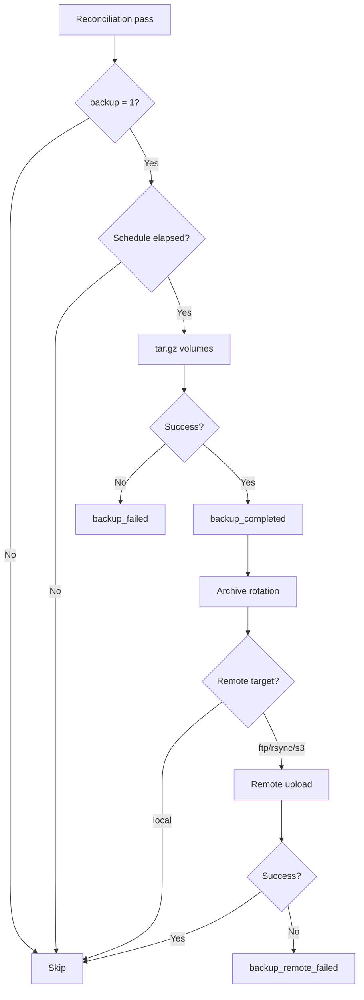

# Scheduled Backups

The backup module (`lib/backup.sh`) automatically archives bind-mounted volumes of services on a configurable schedule, with optional upload to a remote target.

## How It Works

On each reconciliation pass, SORK checks for each service with `backup = 1`:

1. **Schedule check** -- has the configured delay (`backup_schedule`) elapsed since the last backup?
2. **Archival** -- creation of a `tar.gz` of bind-mount paths (`volumes_bind`)
3. **Rotation** -- deletion of oldest archives beyond `backup_retention`
4. **Remote upload** -- if `backup_target` is `ftp`, `rsync`, or `s3`, upload the archive



## Configuration

Keys to add in the service section of `manifest.ini`:

### Main Keys

| Key | Type | Default | Description |
|---|---|---|---|
| `backup` | bool | `0` | Enable scheduled backups |
| `backup_schedule` | string | `86400` | Interval between backups. Accepts seconds or: `hourly` (3600s), `daily` (86400s), `weekly` (604800s) |
| `backup_target` | string | `local` | Backup target: `local`, `ftp`, `rsync`, `s3` |
| `backup_retention` | int | `7` | Number of backups to keep |

### FTP Keys

| Key | Type | Description |
|---|---|---|
| `backup_ftp_host` | string | FTP host |
| `backup_ftp_user` | string | FTP username |
| `backup_ftp_pass` | string | FTP password |
| `backup_ftp_path` | string | Remote path (default: `/backups`) |

### rsync Keys

| Key | Type | Description |
|---|---|---|
| `backup_rsync_dest` | string | rsync destination (e.g., `user@host:/backups`) |
| `backup_rsync_pass` | string | Password (optional, uses sshpass or RSYNC_PASSWORD) |
| `backup_rsync_opts` | string | rsync options (default: `-az`) |

### S3 Keys

| Key | Type | Description |
|---|---|---|
| `backup_s3_bucket` | string | S3 bucket name |
| `backup_s3_prefix` | string | Object prefix (default: `/backups`) |
| `backup_s3_endpoint` | string | S3 endpoint URL (optional, for MinIO or S3-compatible) |
| `backup_s3_region` | string | AWS region (default: `us-east-1`) |

## Examples

### Daily local backup

```ini
[my-app]
image = myapp:latest
volumes_bind = /data/myapp:/app/data
backup = 1
backup_schedule = daily
backup_retention = 7
```

### Weekly FTP backup

```ini
[my-app]
image = myapp:latest
volumes_bind = /data/myapp:/app/data
backup = 1
backup_schedule = weekly
backup_target = ftp
backup_ftp_host = ftp.example.com
backup_ftp_user = backup-user
backup_ftp_pass = secret
backup_ftp_path = /backups/myapp
backup_retention = 4
```

### S3 backup

```ini
[my-app]
image = myapp:latest
volumes_bind = /data/myapp:/app/data
backup = 1
backup_schedule = daily
backup_target = s3
backup_s3_bucket = my-backups
backup_s3_prefix = /sork/myapp
backup_s3_region = eu-west-1
backup_retention = 14
```

## REST API

| Method | Endpoint | Description |
|---|---|---|
| `GET` | `/api/backup/status` | Backup status for all services |
| `POST` | `/api/backup/trigger/{name}` | Trigger an immediate backup |
| `GET` | `/api/backup/list/{name}` | List archives for a service |
| `GET` | `/api/backup/download/{name}/{filename}` | Download an archive |
| `POST` | `/api/backup/config/{name}` | Update backup configuration for a service |
| `GET` | `/api/backup/defaults` | Default configuration template |

## Events and Notifications

| Event | Severity | Description |
|---|---|---|
| `backup_completed` | `ok` | Backup completed successfully |
| `backup_failed` | `warn` | Archive creation failed |
| `backup_remote_failed` | `warn` | Remote upload failed |

## Archive Storage

Archives are stored in `.sork/backups/<app>/` with the naming format:

```
<app>-<YYYYMMDD>-<HHMMSS>.tar.gz
```

## Functions (lib/backup.sh)

| Function | Description |
|---|---|
| `backup_enabled` | Check if backup is enabled for a service |
| `backup_interval` | Return the interval in seconds |
| `backup_app_volumes` | Create the archive and manage rotation + remote upload |
| `backup_check_app` | Check and execute backup for a service |
| `backup_check_all` | Check all services (called in the reconciliation loop) |
| `backup_list` | List archives for a service |
