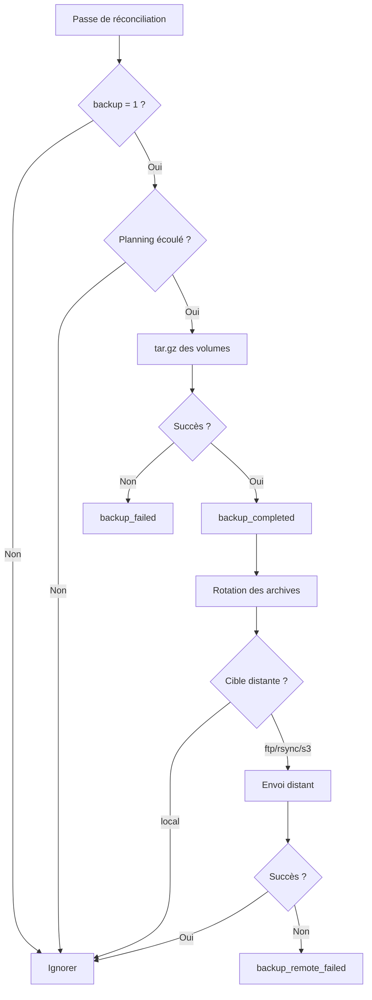

# Sauvegarde planifiée

Le module de sauvegarde (`lib/backup.sh`) archive automatiquement les volumes bind-mount des services selon un planning configurable, avec envoi optionnel vers une cible distante.

## Fonctionnement

À chaque passe de réconciliation, SORK vérifie pour chaque service ayant `backup = 1` :

1. **Vérification du planning** -- le délai configuré (`backup_schedule`) est-il écoulé depuis la dernière sauvegarde ?
2. **Archivage** -- création d'un `tar.gz` des chemins bind-mount (`volumes_bind`)
3. **Rotation** -- suppression des archives les plus anciennes au-delà de `backup_retention`
4. **Envoi distant** -- si `backup_target` est `ftp`, `rsync` ou `s3`, envoi de l'archive



## Configuration

Clés à ajouter dans la section du service dans `manifest.ini` :

### Clés principales

| Clé | Type | Défaut | Description |
|---|---|---|---|
| `backup` | bool | `0` | Activer la sauvegarde planifiée |
| `backup_schedule` | string | `86400` | Intervalle entre les sauvegardes. Accepte un nombre de secondes ou : `hourly` (3600s), `daily` (86400s), `weekly` (604800s) |
| `backup_target` | string | `local` | Cible de sauvegarde : `local`, `ftp`, `rsync`, `s3` |
| `backup_retention` | int | `7` | Nombre de sauvegardes à conserver |

### Clés FTP

| Clé | Type | Description |
|---|---|---|
| `backup_ftp_host` | string | Hôte FTP |
| `backup_ftp_user` | string | Utilisateur FTP |
| `backup_ftp_pass` | string | Mot de passe FTP |
| `backup_ftp_path` | string | Chemin distant (défaut : `/backups`) |

### Clés rsync

| Clé | Type | Description |
|---|---|---|
| `backup_rsync_dest` | string | Destination rsync (ex: `user@host:/backups`) |
| `backup_rsync_pass` | string | Mot de passe (optionnel, utilise sshpass ou RSYNC_PASSWORD) |
| `backup_rsync_opts` | string | Options rsync (défaut : `-az`) |

### Clés S3

| Clé | Type | Description |
|---|---|---|
| `backup_s3_bucket` | string | Nom du bucket S3 |
| `backup_s3_prefix` | string | Préfixe des objets (défaut : `/backups`) |
| `backup_s3_endpoint` | string | URL de l'endpoint S3 (optionnel, pour MinIO ou compatible S3) |
| `backup_s3_region` | string | Région AWS (défaut : `us-east-1`) |

## Exemples

### Sauvegarde locale quotidienne

```ini
[my-app]
image = myapp:latest
volumes_bind = /data/myapp:/app/data
backup = 1
backup_schedule = daily
backup_retention = 7
```

### Sauvegarde FTP hebdomadaire

```ini
[my-app]
image = myapp:latest
volumes_bind = /data/myapp:/app/data
backup = 1
backup_schedule = weekly
backup_target = ftp
backup_ftp_host = ftp.example.com
backup_ftp_user = backup-user
backup_ftp_pass = secret
backup_ftp_path = /backups/myapp
backup_retention = 4
```

### Sauvegarde S3

```ini
[my-app]
image = myapp:latest
volumes_bind = /data/myapp:/app/data
backup = 1
backup_schedule = daily
backup_target = s3
backup_s3_bucket = my-backups
backup_s3_prefix = /sork/myapp
backup_s3_region = eu-west-1
backup_retention = 14
```

## API REST

| Méthode | Endpoint | Description |
|---|---|---|
| `GET` | `/api/backup/status` | État des sauvegardes pour tous les services |
| `POST` | `/api/backup/trigger/{name}` | Déclencher une sauvegarde immédiate |
| `GET` | `/api/backup/list/{name}` | Lister les archives d'un service |
| `GET` | `/api/backup/download/{name}/{filename}` | Télécharger une archive |
| `POST` | `/api/backup/config/{name}` | Modifier la configuration backup d'un service |
| `GET` | `/api/backup/defaults` | Template de configuration par défaut |

## Événements et notifications

| Événement | Sévérité | Description |
|---|---|---|
| `backup_completed` | `ok` | Sauvegarde terminée avec succès |
| `backup_failed` | `warn` | Échec de la création de l'archive |
| `backup_remote_failed` | `warn` | Échec de l'envoi vers la cible distante |

## Stockage des archives

Les archives sont stockées dans `.sork/backups/<app>/` avec le format de nom :

```
<app>-<YYYYMMDD>-<HHMMSS>.tar.gz
```

## Fonctions (lib/backup.sh)

| Fonction | Description |
|---|---|
| `backup_enabled` | Vérifie si le backup est activé pour un service |
| `backup_interval` | Retourne l'intervalle en secondes |
| `backup_app_volumes` | Crée l'archive et gère la rotation + envoi distant |
| `backup_check_app` | Vérifie et exécute le backup pour un service |
| `backup_check_all` | Vérifie tous les services (appelé dans la boucle de réconciliation) |
| `backup_list` | Liste les archives d'un service |
