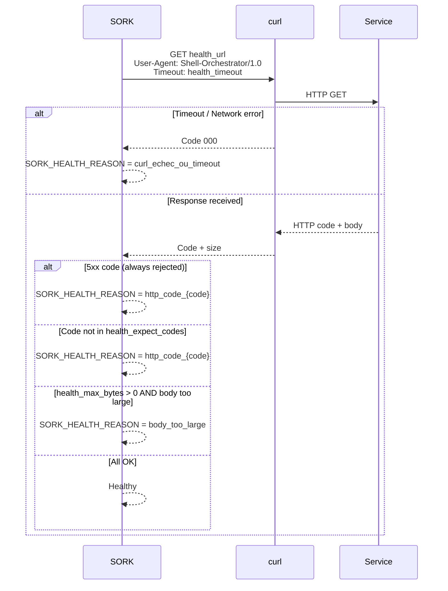
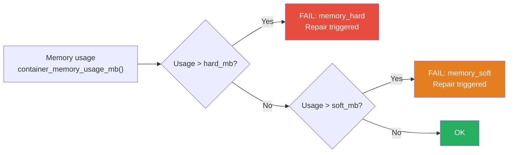
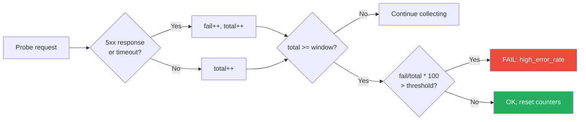

# Health Checks & Monitoring

The `health.sh` module implements service monitoring. On each reconciliation cycle, the `deep_diagnose_name()` function executes a sequence of 8 checks that are independently configurable per service. Execution order is determined by criticality: an OOM kill is detected before high latency.

### Check Sequence

Checks are executed in this order. The first failure interrupts the sequence and reports the cause.

| # | Check | Function | Reason Code |
|---|---|---|---|
| 1 | OOM Killed | `inspect_oom_killed()` | `oom_killed` |
| 2 | Memory > hard threshold | `container_memory_usage_mb()` | `memory_hard` |
| 3 | Memory > soft threshold | (same) | `memory_soft` (triggers repair) |
| 4 | HTTP or TCP probe | `health_http()` / `health_tcp()` | `curl_echec`, `http_code_XXX`, `tcp_refused` |
| 5 | Log analysis | `container_recent_logs()` | `log_anomaly` |
| 6 | HTTP latency | `http_total_time_ms()` | `high_latency` |
| 7 | HTTP error rate | sliding window | `high_error_rate` |
| 8 | Disk space | `check_disk_usage_limit()` | `disk_full` |


Each check is conditional on `monitoring_enabled(app, type)`. If the type is not in `monitoring_types`, it is skipped.

---

## Per-Service Configuration

### Enabling/Disabling Monitoring Types

```ini
[mon-service]
monitoring_types = all                          # All types (default)
monitoring_types = health,memory,oom            # Specific selection
monitoring_types = none                         # Disable all monitoring
```

Available types: `health`, `memory`, `oom`, `restart`, `logs`, `http_latency`, `http_error_rate`, `disk`

The `monitoring_enabled(app, type)` function is called before each check. If the type is not in the list, the check is skipped.

---

## 1. HTTP / HTTPS Probes

The HTTP probe is the most common health check. The `health_http()` function sends a GET request and analyzes the response.

### Configuration

```ini
[mon-service]
health_type = http                    # or https
health_url = http://127.0.0.1:8080/health
health_expect_codes = 200,204         # Accepted codes (CSV, default: 200)
health_timeout = 5                    # Timeout in seconds (default: 5)
health_max_bytes = 0                  # Max response size (0 = unlimited)
```

### Detailed Operation



### Important Rules

- **5xx codes are always rejected**, even if they are in `health_expect_codes`
- The `User-Agent` is always `Shell-Orchestrator/1.0`
- The global variables `SORK_HTTP_CODE` and `SORK_HEALTH_REASON` are updated after each probe

### Strict Local Mode

```bash
SORK_STRICT_LOCAL=1 bin/sork run
```

In strict mode, `health_http()` refuses URLs that do not target `localhost`, `127.0.0.1`, or `::1`. The `sork_health_url_is_local()` function validates the URL with a regex.

---

## 2. TCP Probes

For services that do not speak HTTP (Redis, PostgreSQL, etc.).

```ini
[mon-service]
health_type = tcp
health_tcp_port = 6379
health_timeout = 3        # Timeout in seconds (default: 3)
```

The `health_tcp()` function attempts a TCP connection via `nc -z` or `/dev/tcp`. If the connection succeeds within the timeout, the service is healthy.

---

## 3. None Mode

```ini
[mon-service]
health_type = none
```

No health probe. The service is considered healthy as long as the container is running. Other monitoring types (memory, OOM, disk...) remain active if configured.

---

## 4. Memory Monitoring

```ini
[mon-service]
memory_limit_mb = 512    # Docker limit (-m) applied to the container
memory_soft_mb = 256     # Soft threshold → triggers repair
memory_hard_mb = 480     # Critical threshold → triggers repair
```

### Operation

The `container_memory_usage_mb()` function reads `docker stats` output and converts to MB (handles MiB and GiB).



| Threshold | Effect | Example |
|---|---|---|
| **soft** | Triggers repair (log + notification) | Service using 260 MB against 256 MB soft |
| **hard** | Critical → automatic repair | Service using 490 MB against 480 MB hard |

---

## 5. OOM Detection

If the Linux kernel kills a container due to out of memory (OOM Killer), SORK detects it via `inspect_oom_killed()` which reads Docker's `State.OOMKilled` field.

```ini
# No specific configuration, just enable monitoring
monitoring_types = oom   # or "all"
```

---

## 6. Unexpected Restarts

The `detect_unexpected_restart()` function compares the Docker `RestartCount` with the last value stored in `.sork/state/<app>.restart_count`.

If the counter has increased without SORK action, an incident is recorded:

```
[WARN] web: unexpected_restart - Restart count changed from 2 to 5
```

---

## 7. Log Analysis

```ini
[mon-service]
monitoring_log_tail = 120                                   # Lines to analyze (default: 120)
monitoring_log_error_regex = "FATAL|PANIC|Segmentation"     # Custom regex
```

The `container_recent_logs()` function retrieves the last N lines with `docker logs --tail`. If the regex matches, a `log_anomaly` incident is recorded.

!!! tip "Default regex"
    If you do not specify a regex, SORK uses a built-in pattern that detects common critical errors (FATAL, PANIC, Segmentation fault, Out of memory...).

---

## 8. HTTP Latency

```ini
[mon-service]
monitoring_http_latency_max_ms = 1200   # Max latency in ms (default: 1200)
```

The `http_total_time_ms()` function measures the total curl request time and converts it to milliseconds. If the time exceeds the threshold, a `high_latency` incident is recorded.

---

## 9. HTTP Error Rate

```ini
[mon-service]
monitoring_http_error_rate_threshold_pct = 30   # Threshold in % (default: 30)
monitoring_http_error_rate_window = 20          # Window size (default: 20)
```

### Sliding Window Operation



State is persisted in `.sork/state/<app>.http_errrate` (format: `fail total`).

The functions `http_error_rate_state_get()` and `http_error_rate_state_set()` handle reading/writing.

---

## 10. Disk Space

```ini
[mon-service]
monitoring_disk_usage_max_pct = 90   # Threshold in % (default: 90)
```

The `check_disk_usage_limit()` function checks:

1. The `SORK_DATA` directory (`.sork/`)
2. Each bind mount path defined in `volumes_bind`

It uses `df -P` via `disk_usage_pct_for_path()` to get the usage percentage.

---

## health.sh Module Functions

| Function | Parameters | Return | Description |
|---|---|---|---|
| `monitoring_enabled` | `app`, `type` | 0/1 | Check if a monitoring type is active |
| `health_tcp` | `host`, `port`, `[timeout]` | 0/1 | TCP probe (nc or /dev/tcp) |
| `health_http` | `url`, `[timeout]`, `[expect]`, `[max_bytes]` | 0/1 | HTTP probe with validation |
| `sork_health_url_is_local` | `url` | 0/1 | Check if URL targets localhost |
| `container_memory_usage_mb` | `name` | Integer (MB) | Container memory usage |
| `container_recent_logs` | `name`, `[tail]` | Text | Last lines of logs |
| `container_resource_snapshot` | `name` | `CPU\|Mem` | CPU and memory snapshot |
| `http_total_time_ms` | `url`, `[timeout]` | Integer (ms) | HTTP response time |
| `http_probe_code` | `url`, `[timeout]` | HTTP code | Response code only |
| `http_error_rate_state_get` | `app` | `fail total` | Read sliding window |
| `http_error_rate_state_set` | `app`, `fail`, `total` | — | Write sliding window |
| `disk_usage_pct_for_path` | `path` | Integer (%) | Disk usage for path |
| `check_disk_usage_limit` | `app` | 0/1 | Check all volumes |
| `deep_diagnose_name` | `app`, `name` | 0/1 | Full diagnostic (8 types) |
| `deep_diagnose` | `app` | 0/1 | Wrapper with standard name |

---

## Complete Configuration Example

```ini
[web-app]
image = myapp:latest
publish = 127.0.0.1:3000:3000

# HTTP probe
health_type = http
health_url = http://127.0.0.1:3000/health
health_expect_codes = 200
health_timeout = 5
health_max_bytes = 10240

# Memory
memory_limit_mb = 512
memory_soft_mb = 256
memory_hard_mb = 480

# Active monitoring
monitoring_types = health,memory,oom,logs,http_latency,http_error_rate,disk
monitoring_log_tail = 200
monitoring_log_error_regex = "FATAL|PANIC|OOM|Segmentation fault"
monitoring_http_latency_max_ms = 800
monitoring_http_error_rate_threshold_pct = 25
monitoring_http_error_rate_window = 30
monitoring_disk_usage_max_pct = 85
```
