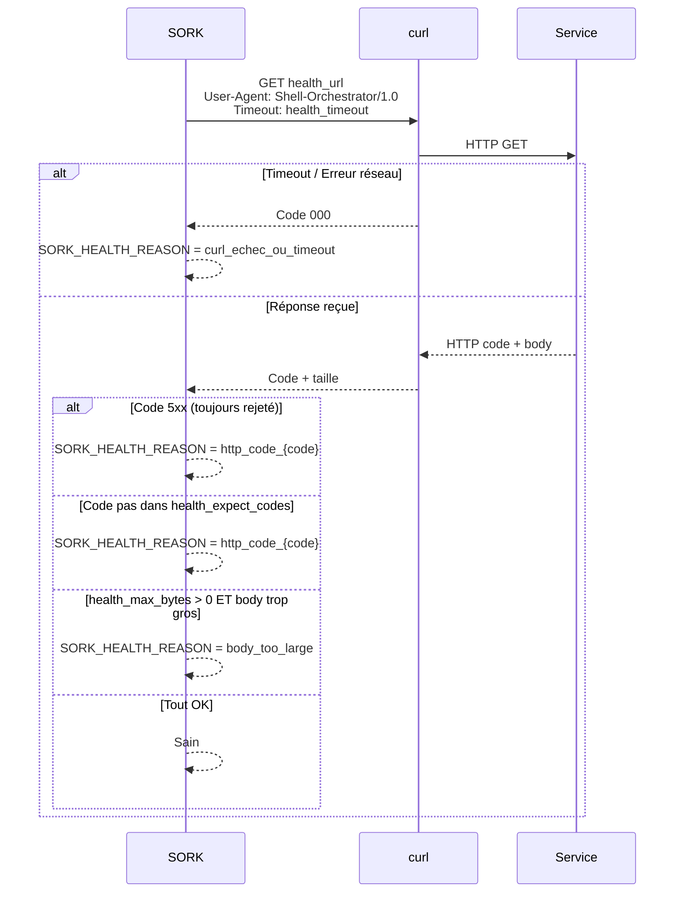
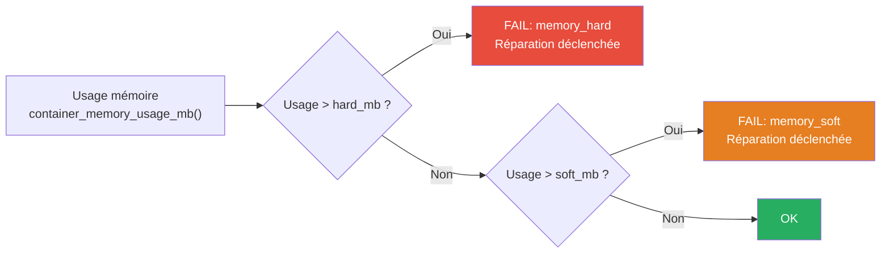
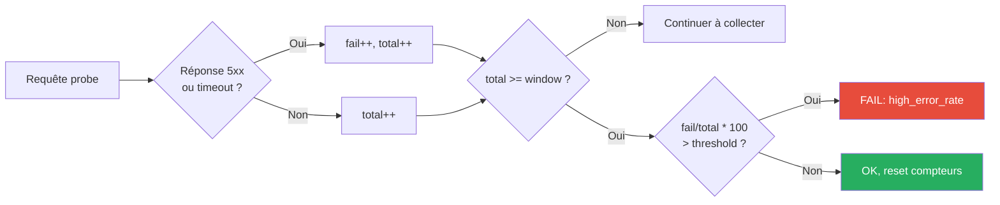

# Vérifications de santé et monitoring

Le module `health.sh` implémente la surveillance des services. À chaque cycle de réconciliation, la fonction `deep_diagnose_name()` exécute une séquence de 8 checks configurables indépendamment par service. L'ordre d'exécution est déterminé par la criticité : un OOM kill est détecté avant une latence élevée.

### Séquence des checks

Les checks sont exécutés dans cet ordre. Le premier échec interrompt la séquence et remonte la cause.

| # | Check | Fonction | Code de raison |
|---|---|---|---|
| 1 | OOM Killed | `inspect_oom_killed()` | `oom_killed` |
| 2 | Mémoire > hard threshold | `container_memory_usage_mb()` | `memory_hard` |
| 3 | Mémoire > soft threshold | (même) | `memory_soft` (déclenche repair) |
| 4 | Probe HTTP ou TCP | `health_http()` / `health_tcp()` | `curl_echec`, `http_code_XXX`, `tcp_refused` |
| 5 | Analyse de logs | `container_recent_logs()` | `log_anomaly` |
| 6 | Latence HTTP | `http_total_time_ms()` | `high_latency` |
| 7 | Error rate HTTP | fenêtre glissante | `high_error_rate` |
| 8 | Espace disque | `check_disk_usage_limit()` | `disk_full` |


Chaque check est conditionné par `monitoring_enabled(app, type)`. Si le type n'est pas dans `monitoring_types`, il est ignoré.

---

## Configuration par service

### Activer/désactiver les types de monitoring

```ini
[mon-service]
monitoring_types = all                          # Tous les types (défaut)
monitoring_types = health,memory,oom            # Sélection spécifique
monitoring_types = none                         # Désactiver tout monitoring
```

Types disponibles : `health`, `memory`, `oom`, `restart`, `logs`, `http_latency`, `http_error_rate`, `disk`

La fonction `monitoring_enabled(app, type)` est appelée avant chaque vérification. Si le type n'est pas dans la liste, la vérification est ignorée.

---

## 1. Probes HTTP / HTTPS

La probe HTTP est le health check le plus courant. La fonction `health_http()` envoie une requête GET et analyse la réponse.

### Configuration

```ini
[mon-service]
health_type = http                    # ou https
health_url = http://127.0.0.1:8080/health
health_expect_codes = 200,204         # Codes acceptés (CSV, défaut: 200)
health_timeout = 5                    # Timeout en secondes (défaut: 5)
health_max_bytes = 0                  # Taille max réponse (0 = illimité)
```

### Fonctionnement détaillé



### Règles importantes

- **Les codes 5xx sont toujours rejetés**, même s'ils sont dans `health_expect_codes`
- Le `User-Agent` est toujours `Shell-Orchestrator/1.0`
- Les variables globales `SORK_HTTP_CODE` et `SORK_HEALTH_REASON` sont mises à jour après chaque probe

### Mode strict local

```bash
SORK_STRICT_LOCAL=1 bin/sork run
```

En mode strict, `health_http()` refuse les URLs qui ne ciblent pas `localhost`, `127.0.0.1` ou `::1`. La fonction `sork_health_url_is_local()` valide l'URL avec un regex.

---

## 2. Probes TCP

Pour les services qui ne parlent pas HTTP (Redis, PostgreSQL, etc.).

```ini
[mon-service]
health_type = tcp
health_tcp_port = 6379
health_timeout = 3        # Timeout en secondes (défaut: 3)
```

La fonction `health_tcp()` tente une connexion TCP via `nc -z` ou `/dev/tcp`. Si la connexion réussit dans le délai, le service est sain.

---

## 3. Mode none

```ini
[mon-service]
health_type = none
```

Aucune probe de santé. Le service est considéré sain tant que le conteneur tourne. Les autres monitoring (mémoire, OOM, disque...) restent actifs si configurés.

---

## 4. Surveillance mémoire

```ini
[mon-service]
memory_limit_mb = 512    # Limite Docker (-m) appliquée au conteneur
memory_soft_mb = 256     # Seuil souple → déclenche réparation
memory_hard_mb = 480     # Seuil critique → déclenche réparation
```

### Fonctionnement

La fonction `container_memory_usage_mb()` lit la sortie de `docker stats` et convertit en Mo (gère MiB et GiB).



| Seuil | Effet | Exemple |
|---|---|---|
| **soft** | Déclenche réparation (log + notification) | Service utilise 260 Mo sur 256 Mo soft |
| **hard** | Critique → réparation automatique | Service utilise 490 Mo sur 480 Mo hard |

---

## 5. Détection OOM

Si le kernel Linux tue un conteneur par manque de mémoire (OOM Killer), SORK le détecte via `inspect_oom_killed()` qui lit le champ `State.OOMKilled` de Docker.

```ini
# Pas de configuration spécifique, juste activer le monitoring
monitoring_types = oom   # ou "all"
```

---

## 6. Redémarrages inattendus

La fonction `detect_unexpected_restart()` compare le `RestartCount` Docker avec la dernière valeur stockée dans `.sork/state/<app>.restart_count`.

Si le compteur a augmenté sans action de SORK, un incident est enregistré :

```
[WARN] web: unexpected_restart - Restart count passé de 2 à 5
```

---

## 7. Analyse de logs

```ini
[mon-service]
monitoring_log_tail = 120                                   # Lignes à analyser (défaut: 120)
monitoring_log_error_regex = "FATAL|PANIC|Segmentation"     # Regex personnalisé
```

La fonction `container_recent_logs()` récupère les N dernières lignes avec `docker logs --tail`. Si le regex matche, un incident `log_anomaly` est enregistré.

!!! tip "Regex par défaut"
    Si vous ne spécifiez pas de regex, SORK utilise un pattern built-in qui détecte les erreurs critiques courantes (FATAL, PANIC, Segmentation fault, Out of memory...).

---

## 8. Latence HTTP

```ini
[mon-service]
monitoring_http_latency_max_ms = 1200   # Latence max en ms (défaut: 1200)
```

La fonction `http_total_time_ms()` mesure le temps total de la requête curl et le convertit en millisecondes. Si le temps dépasse le seuil, un incident `high_latency` est enregistré.

---

## 9. Taux d'erreur HTTP

```ini
[mon-service]
monitoring_http_error_rate_threshold_pct = 30   # Seuil en % (défaut: 30)
monitoring_http_error_rate_window = 20          # Taille de la fenêtre (défaut: 20)
```

### Fonctionnement de la fenêtre glissante



L'état est persisté dans `.sork/state/<app>.http_errrate` (format : `fail total`).

Les fonctions `http_error_rate_state_get()` et `http_error_rate_state_set()` gèrent la lecture/écriture.

---

## 10. Espace disque

```ini
[mon-service]
monitoring_disk_usage_max_pct = 90   # Seuil en % (défaut: 90)
```

La fonction `check_disk_usage_limit()` vérifie :

1. Le répertoire `SORK_DATA` (`.sork/`)
2. Chaque chemin de bind mount défini dans `volumes_bind`

Elle utilise `df -P` via `disk_usage_pct_for_path()` pour obtenir le pourcentage d'utilisation.

---

## Fonctions du module health.sh

| Fonction | Paramètres | Retour | Description |
|---|---|---|---|
| `monitoring_enabled` | `app`, `type` | 0/1 | Vérifie si un type de monitoring est actif |
| `health_tcp` | `host`, `port`, `[timeout]` | 0/1 | Probe TCP (nc ou /dev/tcp) |
| `health_http` | `url`, `[timeout]`, `[expect]`, `[max_bytes]` | 0/1 | Probe HTTP avec validation |
| `sork_health_url_is_local` | `url` | 0/1 | Vérifie si l'URL cible localhost |
| `container_memory_usage_mb` | `name` | Entier (Mo) | Usage mémoire du conteneur |
| `container_recent_logs` | `name`, `[tail]` | Texte | Dernières lignes de logs |
| `container_resource_snapshot` | `name` | `CPU\|Mem` | Snapshot CPU et mémoire |
| `http_total_time_ms` | `url`, `[timeout]` | Entier (ms) | Temps de réponse HTTP |
| `http_probe_code` | `url`, `[timeout]` | Code HTTP | Code de réponse seulement |
| `http_error_rate_state_get` | `app` | `fail total` | Lecture fenêtre glissante |
| `http_error_rate_state_set` | `app`, `fail`, `total` | — | Écriture fenêtre glissante |
| `disk_usage_pct_for_path` | `path` | Entier (%) | Usage disque du chemin |
| `check_disk_usage_limit` | `app` | 0/1 | Vérification de tous les volumes |
| `deep_diagnose_name` | `app`, `name` | 0/1 | Diagnostic complet (8 types) |
| `deep_diagnose` | `app` | 0/1 | Wrapper avec nom standard |

---

## Exemple de configuration complète

```ini
[web-app]
image = myapp:latest
publish = 127.0.0.1:3000:3000

# Probe HTTP
health_type = http
health_url = http://127.0.0.1:3000/health
health_expect_codes = 200
health_timeout = 5
health_max_bytes = 10240

# Mémoire
memory_limit_mb = 512
memory_soft_mb = 256
memory_hard_mb = 480

# Monitoring actif
monitoring_types = health,memory,oom,logs,http_latency,http_error_rate,disk
monitoring_log_tail = 200
monitoring_log_error_regex = "FATAL|PANIC|OOM|Segmentation fault"
monitoring_http_latency_max_ms = 800
monitoring_http_error_rate_threshold_pct = 25
monitoring_http_error_rate_window = 30
monitoring_disk_usage_max_pct = 85
```
