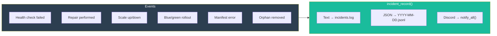
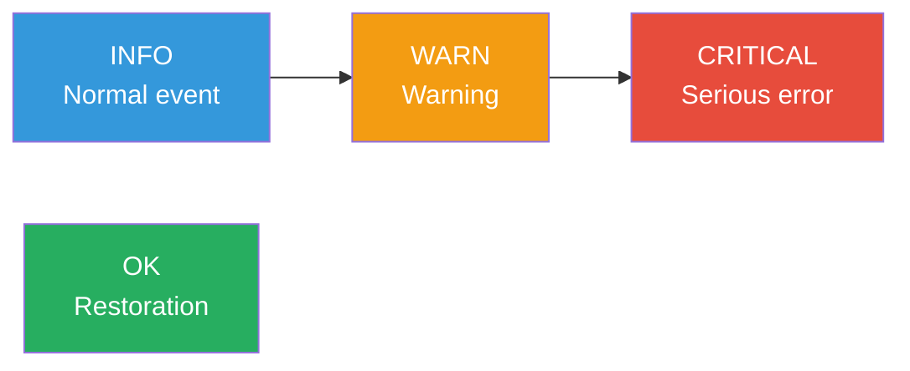

# Incidents

The `incidents.sh` module centralizes the recording of all operational events: outages, repairs, scaling, configuration errors, backend changes.

---

## Overview



---

## Recording

The `incident_record()` function is the single entry point for all incidents:

```bash
incident_record "$app" "$severity" "$event" "$detail" ["$skip_discord"]
```

| Parameter | Type | Description |
|---|---|---|
| `app` | string | Name of the affected service (or `global`) |
| `severity` | string | `info`, `warn`, `critical`, `ok` |
| `event` | string | Machine-readable type (e.g., `unhealthy`, `repair_restart`) |
| `detail` | string | Human-readable description or key=value pairs |
| `skip_discord` | string | `1` to skip notification (optional) |

### What It Does

1. Writes a structured log via `sork_log()` (stderr + JSON file)
2. Appends a line to the text log (`.sork/incidents/incidents.log`)
3. Appends a JSON entry to the daily file (`.sork/incidents/YYYY-MM-DD.jsonl`)
4. Sends a Discord notification via `notify_all()` (unless `skip_discord=1`)

---

## Output Formats

### Text Log

Append-only file `.sork/incidents/incidents.log`:

```
2025-01-15 10:30:00 [CRITICAL] web: unhealthy - HTTP health check failed (code 503)
2025-01-15 10:30:15 [INFO] web: repair_restart - Container restarted
2025-01-15 10:31:00 [OK] web: recovery - Service restored
2025-01-15 10:45:00 [INFO] api: autoscale_up - Added replica sork-api-r3
2025-01-15 11:00:00 [WARN] redis: memory_soft - Memory usage 280MB (threshold: 256MB)
```

### JSONL Archive

Daily files `.sork/incidents/YYYY-MM-DD.jsonl`:

```json
{"ts":"2025-01-15T10:30:00Z","app":"web","severity":"critical","event":"unhealthy","detail":"HTTP health check failed (code 503)"}
{"ts":"2025-01-15T10:30:15Z","app":"web","severity":"info","event":"repair_restart","detail":"Container restarted"}
{"ts":"2025-01-15T10:31:00Z","app":"web","severity":"ok","event":"recovery","detail":"Service restored"}
```

---

## Severity Levels



| Severity | Usage | Examples | Discord Color |
|---|---|---|---|
| `info` | Expected normal event | Scaling, successful repair, blue/green switch | Blue |
| `warn` | Situation to monitor | Soft memory, orphan removed, replica missing | Orange |
| `critical` | Serious error requiring attention | Service outage, repair failure, blue/green failure | Red |
| `ok` | Service restored after outage | Recovery, proxy backend up | Green |

---

## Complete Event Catalog

### Health and Repair

| Event | Severity | Description |
|---|---|---|
| `unhealthy` | `critical` | Health check failed |
| `repair_restart` | `info` | Container restarted |
| `repair_recreate` | `info` | Container recreated |
| `repair_purge` | `warn` | Purge performed (volumes potentially removed) |
| `repair_failed` | `critical` | All repair strategies have failed |
| `recovery` | `ok` | Service restored after outage |
| `escalade_max` | `critical` | max_repair threshold reached |
| `volume_remove_failed` | `warn` | Volume removal failed during purge |
| `container_create_failed` | `critical` | docker run failed |
| `unexpected_restart` | `warn` | Restart detected without SORK action |

### Blue/Green

| Event | Severity | Description |
|---|---|---|
| `bluegreen_start` | `info` | Rollout started |
| `bluegreen_switch` | `info` | Switchover successful |
| `bluegreen_fail` | `critical` | Candidate failed |
| `preflight_start` | `info` | Preflight command launched |

### Autoscale

| Event | Severity | Description |
|---|---|---|
| `autoscale_up` | `info` | Replica added |
| `autoscale_down` | `info` | Replica removed |
| `autoscale_max_reached` | `info` | Maximum replicas reached |
| `autoscale_port_exhausted` | `critical` | No more ports available |
| `autoscale_scale_up_failed` | `critical` | Replica creation failed |
| `autoscale_replica_disappeared` | `warn` | Replica container not found |
| `autoscale_replica_stopped` | `warn` | Replica stopped |
| `autoscale_recreate_failed` | `critical` | Replica recreation failed |
| `autoscale_lb_restarted` | `warn` | Proxy relaunched after crash |

### Proxy

| Event | Severity | Description |
|---|---|---|
| `proxy_backend_down` | `warn` | Backend removed from rotation |
| `proxy_backend_up` | `ok` | Backend restored to rotation |
| `global_proxy_started` | `info` | Global proxy started |
| `global_proxy_stopped` | `info` | Global proxy stopped |

### Manifest and System

| Event | Severity | Description |
|---|---|---|
| `manifest_load_failed` | `critical` | Manifest loading failed |
| `manifest_duplicate_key` | `critical` | Duplicate key in manifest |
| `manifest_empty` | `critical` | Manifest with no applications |
| `runtime_unavailable` | `critical` | Neither Docker nor Podman found |
| `orphan_removed` | `warn` | Orphan container removed |
| `suspended` | `critical` | Reconciliation suspended |
| `manual_stop` | `info` | Manual stop detected |

---

## Rotation and Archival

| File | Rotation | Retention |
|---|---|---|
| `incidents.log` | Daily via `incident_archive_daily()` | Old entries → `.sork/archive/incidents-YYYY-MM-DD.log` |
| `YYYY-MM-DD.jsonl` | One file per day | Indefinite retention |

---

## Viewing

### Command Line

```bash
# Latest incidents
tail -30 .sork/incidents/incidents.log

# Critical incidents
grep CRITICAL .sork/incidents/incidents.log

# Incidents for a specific service
grep "web:" .sork/incidents/incidents.log

# JSONL analysis with jq
cat .sork/incidents/2025-01-15.jsonl | jq 'select(.severity=="critical")'

# Count incidents by type
cat .sork/incidents/2025-01-15.jsonl | jq -r '.event' | sort | uniq -c | sort -rn
```

### Via the Web Console

The **Orchestrator > Incidents** section offers:

| Method | Endpoint | Description |
|---|---|---|
| `GET` | `/api/incidents?limit=50` | List of recent incidents |
| `POST` | `/api/alerts/ack` | Acknowledge an incident by ID |
| `POST` | `/api/alerts/ack_all` | Acknowledge all incidents |

---

## incidents.sh Module Functions

| Function | Description |
|---|---|
| `incident_log_path()` | Returns the path to `incidents.log` |
| `incident_archive_daily()` | Archives the latest entry to the daily file |
| `_json_escape(s)` | Escapes a string for JSON |
| `incident_record(app, severity, event, detail, [skip_discord])` | Records a complete incident |
