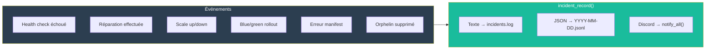
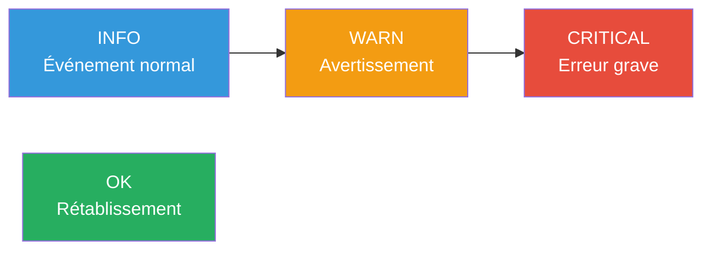

# Incidents

Le module `incidents.sh` centralise l'enregistrement de tous les événements opérationnels : pannes, réparations, scaling, erreurs de configuration, changements de backends.

---

## Vue d'ensemble



---

## Enregistrement

La fonction `incident_record()` est le point d'entrée unique pour tous les incidents :

```bash
incident_record "$app" "$severity" "$event" "$detail" ["$skip_discord"]
```

| Paramètre | Type | Description |
|---|---|---|
| `app` | string | Nom du service concerné (ou `global`) |
| `severity` | string | `info`, `warn`, `critical`, `ok` |
| `event` | string | Type machine-readable (ex: `unhealthy`, `repair_restart`) |
| `detail` | string | Description lisible ou key=value pairs |
| `skip_discord` | string | `1` pour ne pas envoyer de notification (optionnel) |

### Ce qu'elle fait

1. Écrit un log structuré dans `sork_log()` (stderr + fichier JSON)
2. Ajoute une ligne au log texte (`.sork/incidents/incidents.log`)
3. Ajoute un JSON au fichier journalier (`.sork/incidents/YYYY-MM-DD.jsonl`)
4. Envoie une notification Discord via `notify_all()` (sauf si `skip_discord=1`)

---

## Formats de sortie

### Log texte

Fichier append-only `.sork/incidents/incidents.log` :

```
2025-01-15 10:30:00 [CRITICAL] web: unhealthy - Health check HTTP échoué (code 503)
2025-01-15 10:30:15 [INFO] web: repair_restart - Redémarrage du conteneur
2025-01-15 10:31:00 [OK] web: recovery - Service rétabli
2025-01-15 10:45:00 [INFO] api: autoscale_up - Ajout replica sork-api-r3
2025-01-15 11:00:00 [WARN] redis: memory_soft - Usage mémoire 280Mo (seuil: 256Mo)
```

### Archive JSONL

Fichiers journaliers `.sork/incidents/YYYY-MM-DD.jsonl` :

```json
{"ts":"2025-01-15T10:30:00Z","app":"web","severity":"critical","event":"unhealthy","detail":"Health check HTTP échoué (code 503)"}
{"ts":"2025-01-15T10:30:15Z","app":"web","severity":"info","event":"repair_restart","detail":"Redémarrage du conteneur"}
{"ts":"2025-01-15T10:31:00Z","app":"web","severity":"ok","event":"recovery","detail":"Service rétabli"}
```

---

## Niveaux de sévérité



| Sévérité | Usage | Exemples | Couleur Discord |
|---|---|---|---|
| `info` | Événement normal attendu | Scaling, réparation réussie, blue/green switch | Bleu |
| `warn` | Situation à surveiller | Mémoire soft, orphelin supprimé, replica disparue | Orange |
| `critical` | Erreur grave nécessitant attention | Panne service, échec réparation, échec blue/green | Rouge |
| `ok` | Service rétabli après une panne | Recovery, proxy backend up | Vert |

---

## Catalogue complet des événements

### Santé et réparation

| Événement | Sévérité | Description |
|---|---|---|
| `unhealthy` | `critical` | Health check échoué |
| `repair_restart` | `info` | Conteneur redémarré |
| `repair_recreate` | `info` | Conteneur recréé |
| `repair_purge` | `warn` | Purge effectuée (volumes potentiellement supprimés) |
| `repair_failed` | `critical` | Toutes les stratégies de réparation ont échoué |
| `recovery` | `ok` | Service rétabli après une panne |
| `escalade_max` | `critical` | Seuil max_repair atteint |
| `volume_remove_failed` | `warn` | Échec suppression volume lors du purge |
| `container_create_failed` | `critical` | Échec de docker run |
| `unexpected_restart` | `warn` | Redémarrage détecté sans action SORK |

### Blue/Green

| Événement | Sévérité | Description |
|---|---|---|
| `bluegreen_start` | `info` | Début du rollout |
| `bluegreen_switch` | `info` | Bascule réussie |
| `bluegreen_fail` | `critical` | Candidat échoué |
| `preflight_start` | `info` | Commande preflight lancée |

### Autoscale

| Événement | Sévérité | Description |
|---|---|---|
| `autoscale_up` | `info` | Replica ajoutée |
| `autoscale_down` | `info` | Replica supprimée |
| `autoscale_max_reached` | `info` | Maximum de replicas atteint |
| `autoscale_port_exhausted` | `critical` | Plus de ports disponibles |
| `autoscale_scale_up_failed` | `critical` | Échec création replica |
| `autoscale_replica_disappeared` | `warn` | Conteneur replica introuvable |
| `autoscale_replica_stopped` | `warn` | Replica arrêtée |
| `autoscale_recreate_failed` | `critical` | Échec recréation replica |
| `autoscale_lb_restarted` | `warn` | Proxy relancé après crash |

### Proxy

| Événement | Sévérité | Description |
|---|---|---|
| `proxy_backend_down` | `warn` | Backend retiré de la rotation |
| `proxy_backend_up` | `ok` | Backend réintégré |
| `global_proxy_started` | `info` | Proxy global démarré |
| `global_proxy_stopped` | `info` | Proxy global arrêté |

### Manifest et système

| Événement | Sévérité | Description |
|---|---|---|
| `manifest_load_failed` | `critical` | Échec de chargement du manifest |
| `manifest_duplicate_key` | `critical` | Clé dupliquée dans le manifest |
| `manifest_empty` | `critical` | Manifest sans application |
| `runtime_unavailable` | `critical` | Ni Docker ni Podman trouvés |
| `orphan_removed` | `warn` | Conteneur orphelin supprimé |
| `suspended` | `critical` | Réconciliation suspendue |
| `manual_stop` | `info` | Arrêt manuel détecté |

---

## Rotation et archivage

| Fichier | Rotation | Rétention |
|---|---|---|
| `incidents.log` | Quotidienne via `incident_archive_daily()` | Anciennes entrées → `.sork/archive/incidents-YYYY-MM-DD.log` |
| `YYYY-MM-DD.jsonl` | Un fichier par jour | Conservation indéfinie |

---

## Consultation

### En ligne de commande

```bash
# Derniers incidents
tail -30 .sork/incidents/incidents.log

# Incidents critiques
grep CRITICAL .sork/incidents/incidents.log

# Incidents d'un service spécifique
grep "web:" .sork/incidents/incidents.log

# Analyse JSONL avec jq
cat .sork/incidents/2025-01-15.jsonl | jq 'select(.severity=="critical")'

# Compter les incidents par type
cat .sork/incidents/2025-01-15.jsonl | jq -r '.event' | sort | uniq -c | sort -rn
```

### Via la console web

La section **Orchestrator > Incidents** offre :

| Méthode | Endpoint | Description |
|---|---|---|
| `GET` | `/api/incidents?limit=50` | Liste des incidents récents |
| `POST` | `/api/alerts/ack` | Acquitter un incident |
| `POST` | `/api/alerts/ack_all` | Acquitter tous les incidents |

---

## Fonctions du module incidents.sh

| Fonction | Description |
|---|---|
| `incident_log_path()` | Retourne le chemin vers `incidents.log` |
| `incident_archive_daily()` | Archive la dernière entrée dans le fichier journalier |
| `_json_escape(s)` | Échappe une chaîne pour JSON |
| `incident_record(app, severity, event, detail, [skip_discord])` | Enregistre un incident complet |
