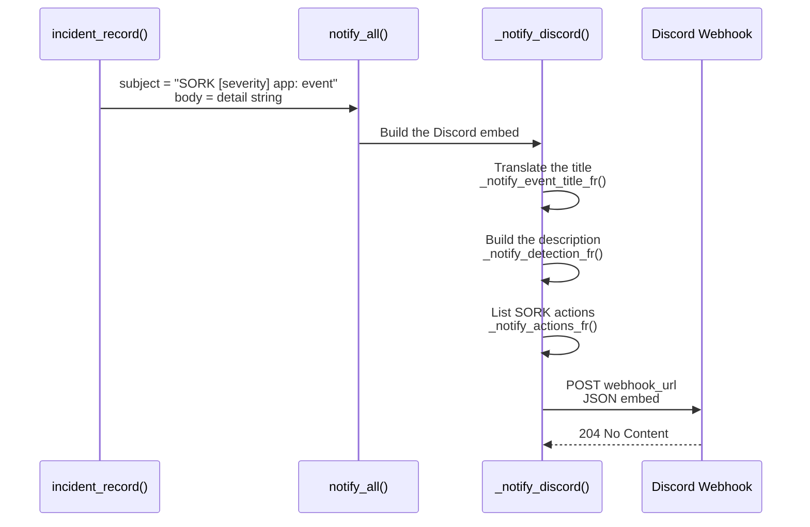
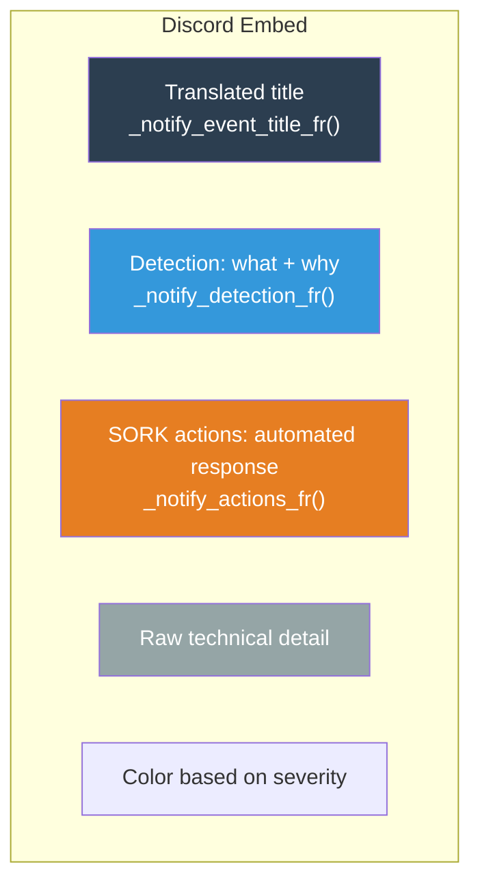

# Notifications

The `notify.sh` module sends alerts across multiple channels (Discord, Slack, Teams, Telegram, SMTP). Each notification is a structured message containing the diagnostic, cause, and corrective actions.

---

## Overview



---

## Configuration

File `etc/notify.ini`:

```ini
[discord]
enabled = 1
webhook_url = https://discord.com/api/webhooks/YOUR_ID/YOUR_TOKEN
```

### Creating a Discord Webhook

1. Open your Discord server
2. **Server Settings** → **Integrations** → **Webhooks**
3. Click **New Webhook**
4. Choose the destination channel
5. Copy the webhook URL
6. Paste it into `etc/notify.ini`

### Testing the Configuration

```bash
# Via the web console REST API
curl -X POST http://localhost:8080/api/notify/test

# Manually with curl
curl -X POST "https://discord.com/api/webhooks/ID/TOKEN" \
  -H "Content-Type: application/json" \
  -d '{"content": "Test SORK"}'
```

---

## Discord Message Structure

Each notification is a **Discord embed** with:



### Colors by Severity

| Severity | Color | Hex Code |
|---|---|---|
| `critical` | Red | `#e74c3c` |
| `warn` | Orange | `#f39c12` |
| `info` | Blue | `#3498db` |
| `ok` | Green | `#2ecc71` |

---

## French Translations

### Event Titles (`_notify_event_title_fr`)

| Event Code | French Title |
|---|---|
| `unhealthy` | Service en panne |
| `repair_restart` | Réparation : redémarrage |
| `repair_recreate` | Réparation : re-création |
| `repair_purge` | Réparation : purge complète |
| `repair_failed` | Échec de réparation |
| `escalade_max` | Seuil maximal d'échecs atteint |
| `recovery` | Service rétabli |
| `bluegreen_start` | Déploiement blue/green : début |
| `bluegreen_switch` | Déploiement blue/green : bascule |
| `bluegreen_fail` | Déploiement blue/green : échec |
| `autoscale_up` | Autoscale : ajout d'un replica |
| `autoscale_down` | Autoscale : suppression d'un replica |
| `autoscale_max_reached` | Autoscale : maximum atteint |
| `orphan_removed` | Conteneur orphelin supprimé |
| `manual_stop` | Arrêt manuel détecté |
| `proxy_backend_down` | Proxy : backend retiré de la rotation |
| `proxy_backend_up` | Proxy : backend réintégré |
| `autoscale_port_exhausted` | Autoscale : plage de ports épuisée |
| `autoscale_scale_up_failed` | Autoscale : échec de création du replica |
| `autoscale_lb_restarted` | Autoscale : proxy relancé après crash |
| `autoscale_replica_disappeared` | Autoscale : replica disparu |
| `autoscale_replica_stopped` | Autoscale : replica arrêté |
| `autoscale_recreate_failed` | Autoscale : échec de recréation |
| `runtime_unavailable` | Moteur conteneur indisponible |
| `container_create_failed` | Échec de création du conteneur |
| `manifest_duplicate_key` | Clé dupliquée dans le manifeste |
| `manifest_empty` | Manifeste sans application |
| `volume_remove_failed` | Échec de suppression d'un volume |

### Reason Codes (`_notify_reason_code_fr`)

| Technical Code | French Description |
|---|---|
| `curl_echec_ou_timeout` | Échec de la requête curl ou timeout |
| `oom_killed` | Conteneur tué par manque de mémoire (OOM) |
| `memory_hard` | Seuil mémoire critique dépassé |
| `memory_soft` | Seuil mémoire d'avertissement dépassé |
| `http_code_XXX` | Code de réponse HTTP XXX |
| `tcp_refused` | Connexion TCP refusée |
| `high_latency` | Temps de réponse trop élevé |
| `high_error_rate` | Taux d'erreur HTTP trop élevé |
| `disk_full` | Utilisation disque trop élevée |
| `log_anomaly` | Anomalie détectée dans les logs |

### Detailed Descriptions (`_notify_detection_fr`)

Each event generates a detailed Markdown description explaining **what was detected** with the specific values extracted from the detail.

### SORK Actions (`_notify_actions_fr`)

Each event includes a list of actions that SORK takes or recommends, as Markdown bullet points.

---

## Anti-Spam

Mechanisms to prevent notification flooding:

| Mechanism | Description |
|---|---|
| `skip_discord` | Certain incidents set this flag to skip notification |
| `manifest_load_warn.notified` | Flag preventing repeated alerts for the same manifest error |
| Unique recovery | Single message when service becomes healthy |
| `manual_pause_notified` | Do not alert on every cycle for a manual pause |
| `suspend_reconcile.notified` | Do not alert on every cycle for a suspension |
| Log anomaly cooldown | 10 minutes between non-blocking log anomaly notifications per service |

---

## Notifications in the Web Console

In parallel with external channels, the Python backend maintains a notification system:

| Feature | Detail |
|---|---|
| **Buffer** | 200 entries max (circular) |
| **Persistence** | `.sork/notifications.json` |
| **Types** | info, warning, error, success |
| **Real-time** | SSE (Server-Sent Events) |

API:

| Method | Endpoint | Description |
|---|---|---|
| `GET` | `/api/notifications/` | List notifications |
| `GET` | `/api/notifications/stream` | Real-time SSE stream |
| `POST` | `/api/notify/save` | Save notification config |
| `POST` | `/api/notify/test` | Send a test message |

---

## Disabling Notifications

```ini
[discord]
enabled = 0
```

Incidents continue to be recorded in logs and archives even if Discord is disabled.

---

## notify.sh Module Functions

| Function | Description |
|---|---|
| `notify_load(path)` | Load configuration from notify.ini |
| `notify_get(section, key)` | Read a config value |
| `notify_get_default(section, key, default)` | Read with fallback |
| `notify_all(subject, body)` | Entry point: send a notification |
| `_notify_discord(subject, body)` | Build and post the Discord embed |
| `_notify_json_escape(s)` | Escape a string for JSON |
| `_notify_event_title_fr(event)` | French event title |
| `_notify_reason_code_fr(raw)` | French reason code description |
| `_notify_detection_fr(event, detail)` | Detection Markdown |
| `_notify_actions_fr(event, detail)` | Actions Markdown |
| `_notify_extract_kv(key, string)` | Extract key=value |
