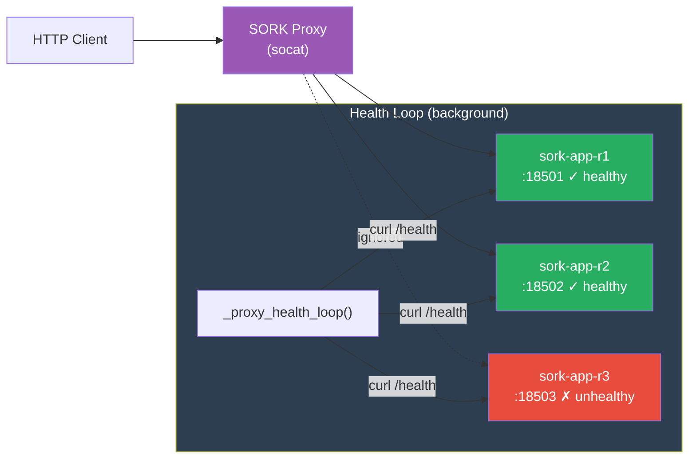
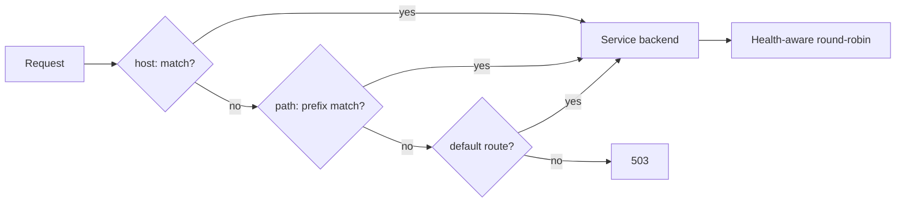
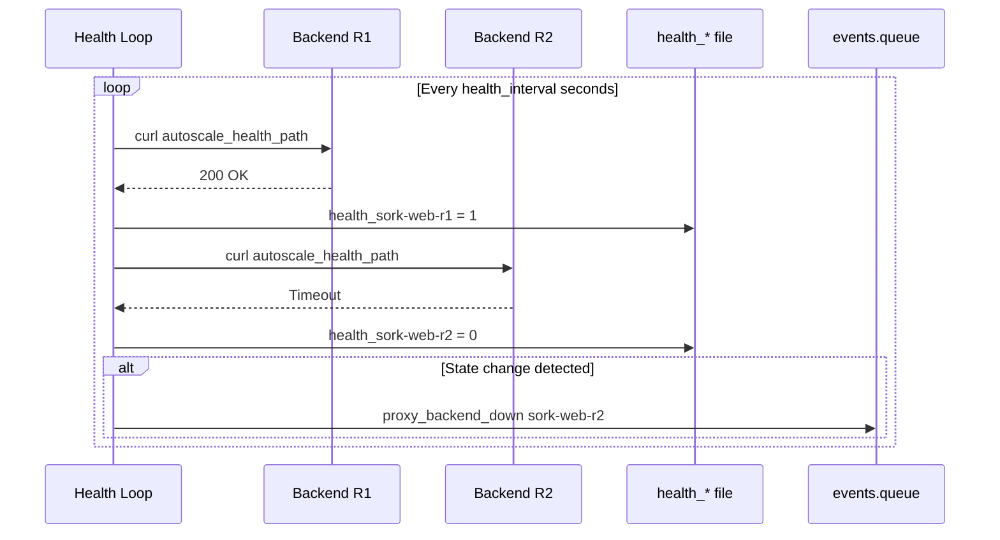

# Proxy & Load Balancer

The `proxy.sh` module implements a TCP reverse proxy based on **socat**: health-aware round-robin, hot-reload of backends, and introspection endpoints (health, state, Prometheus metrics, routes).

---

## Architecture



The proxy:

- Distributes traffic in **round-robin** across healthy backends only
- **Automatically ignores** unhealthy backends
- **Hot-reloads** when backend or route files change
- Writes **events** to `events.queue` when a backend changes state

---

## Operating Modes

### Legacy Mode (per service)

An independent proxy for each autoscaled service:

```ini
[mon-service]
autoscale = 1
autoscale_lb_publish = 127.0.0.1:8080:80
```

The proxy reads the `.sork/autoscale/<app>.backends` file.

### Global Mode

A single proxy for all services:

```ini
[proxy]
listen = 0.0.0.0:8080           # Listen address
autoscale_port_range = 18500-18999
health_interval = 3              # Health check interval (sec)
connect_timeout = 5              # Backend connection timeout (sec)
log_level = info                 # debug, info, warn, error
```

The proxy reads the `.sork/autoscale/routes.conf` file to determine which service to route each request to.

### Routing

Matching order in `_proxy_route_lookup()`:



Per-service route configuration:

```ini
# Routing by hostname (Host header)
[web]
autoscale_route = host:www.example.com

# Routing by URL path prefix
[api]
autoscale_route = path:/api

# Dedicated port (separate proxy launched on this port)
[admin]
autoscale_route = port:9090

# Default route (catch-all)
[fallback]
autoscale_route = default
```

The `_proxy_route_lookup()` function performs matching in order: host → path → default.

---

## Built-in Endpoints

The proxy intercepts certain requests to expose its state:

### GET /sork-proxy/health

Returns `200 OK` if at least one backend is healthy, `503 Service Unavailable` otherwise.

### GET /sork-proxy/state

JSON detailing each backend with its status:

```json
{
  "backends": [
    {"name": "sork-web-r1", "host": "127.0.0.1", "port": 18501, "healthy": true},
    {"name": "sork-web-r2", "host": "127.0.0.1", "port": 18502, "healthy": true},
    {"name": "sork-web-r3", "host": "127.0.0.1", "port": 18503, "healthy": false}
  ]
}
```

In global mode, includes all routes and their respective backends.

### GET /sork-proxy/metrics

Metrics in **Prometheus** format:

```
sork_proxy_requests_total{backend="sork-web-r1"} 1523
sork_proxy_requests_total{backend="sork-web-r2"} 1487
sork_proxy_errors_total{backend="sork-web-r1"} 3
sork_proxy_backend_healthy{backend="sork-web-r1"} 1
sork_proxy_backend_healthy{backend="sork-web-r3"} 0
```

### GET /sork-proxy/routes

Current routing table (global mode only).

---

## Health Check Loop

The `_proxy_health_loop()` function runs in the background and periodically checks each backend:



State files are located in `.sork/autoscale/global-proxy/health_<replica>` (value: `0` or `1`).

Transition events are written to `events.queue` and processed by `autoscale_process_proxy_events()` on the next reconciliation cycle.

---

## Hot-Reload

The proxy monitors its configuration files:

| File | When it changes | Effect |
|---|---|---|
| `.sork/autoscale/<app>.backends` | Scale up/down, replica recreated | Backends updated without interruption |
| `.sork/autoscale/routes.conf` | Manifest modified, service added/removed | Routes updated |

Reloading is done by simply re-reading the file — no need to restart the proxy process.

---

## Backend Selection (Round-Robin)

The `_proxy_pick_backend()` function:

1. Reads the backends file
2. Filters backends marked as healthy (`health_*` = 1)
3. Selects the next backend via atomic round-robin (`_proxy_rr_next()` with flock)
4. Returns `name host port` or error if no healthy backend

---

## Process Management

| PID File | Usage |
|---|---|
| `.sork/autoscale/global-proxy.pid` | Global proxy PID |
| `.sork/autoscale/<app>-lb.pid` | Legacy per-service proxy PID |
| `.sork/autoscale/<app>-dedicated.pid` | Dedicated proxy PID (route port:N) |

The `global_proxy_running()` and `autoscale_lb_running()` functions verify that the process is alive.

On crash, `autoscale_reconcile()` detects the absence and relaunches the proxy, with an `autoscale_lb_restarted` incident if a PID file existed before.

---

## Proxy Environment Variables

The proxy is configured via environment variables passed to its process:

| Variable | Default | Description |
|---|---|---|
| `SORK_PROXY_LISTEN` | `0.0.0.0:8080` | Listen address |
| `SORK_PROXY_BACKENDS` | — | Backends file (legacy mode) |
| `SORK_PROXY_ROUTES` | — | Routes file (global mode) |
| `SORK_PROXY_HEALTH_INTERVAL` | `3` | Health check interval (sec) |
| `SORK_PROXY_HEALTH_PATH` | `/` | HTTP path for probes |
| `SORK_PROXY_HEALTH_TIMEOUT` | `2` | Probe timeout (sec) |
| `SORK_PROXY_CONNECT_TIMEOUT` | `5` | Connection timeout (sec) |
| `SORK_PROXY_LOG_LEVEL` | `info` | Log level |
| `SORK_PROXY_STATE_DIR` | — | State directory (health, metrics) |
| `SORK_PROXY_APP` | — | Application name (for logging) |

---

## proxy.sh Module Functions

| Function | Description |
|---|---|
| `_proxy_handle_connection()` | Handle a single HTTP connection (routing, relay, metrics) |
| `_proxy_pick_backend(bfile, state_dir)` | Round-robin across healthy backends |
| `_proxy_route_lookup(routes, host, path)` | Route matching (host/path/default) |
| `_proxy_health_loop(bfile, state_dir)` | Background health check loop |
| `_proxy_read_backends(bfile, state_dir)` | Read backends with health status |
| `_proxy_build_state_json(...)` | JSON for /sork-proxy/state |
| `_proxy_build_metrics(...)` | Prometheus for /sork-proxy/metrics |
| `_proxy_build_metrics_global(...)` | Prometheus multi-route |
| `_proxy_atomic_inc(file, delta)` | Atomic counter (flock) |
| `_proxy_rr_next(file, count)` | Atomic round-robin index |
| `proxy_log(level, message)` | Proxy logging |
