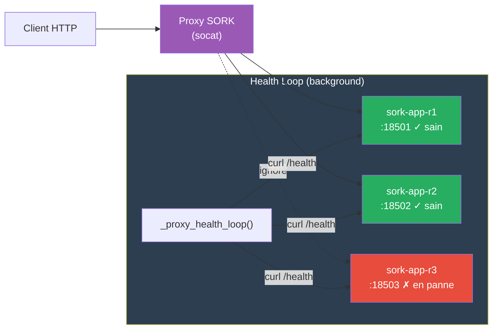
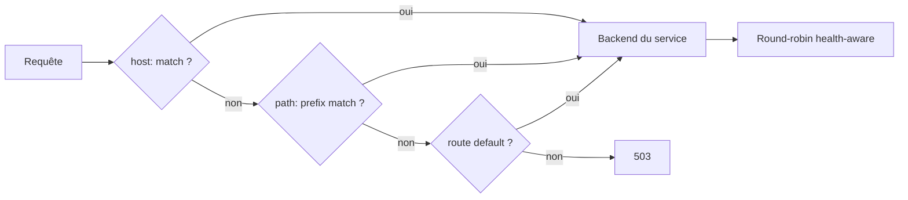
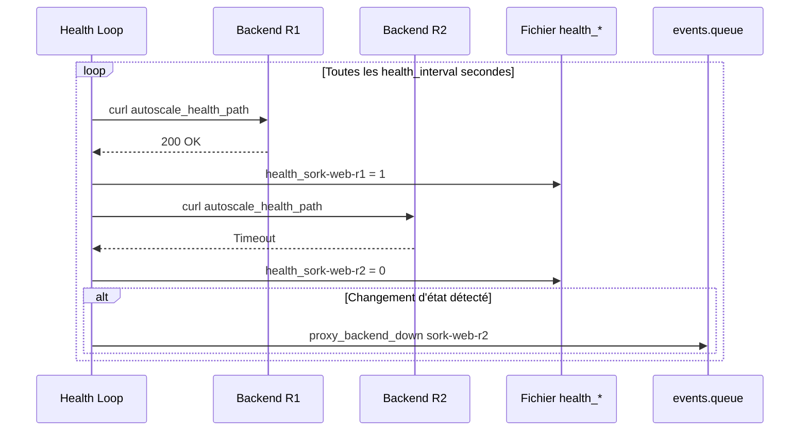

# Proxy & Load Balancer

Le module `proxy.sh` implémente un reverse-proxy TCP basé sur **socat** : round-robin health-aware, hot-reload des backends, et endpoints d'introspection (health, state, metrics Prometheus, routes).

---

## Architecture



Le proxy :

- Distribue le trafic en **round-robin** entre les backends sains uniquement
- **Ignore automatiquement** les backends en panne
- Se **recharge à chaud** quand les fichiers backends ou routes changent
- Écrit des **événements** dans `events.queue` quand un backend change d'état

---

## Modes de fonctionnement

### Mode legacy (par service)

Un proxy indépendant pour chaque service autoscalé :

```ini
[mon-service]
autoscale = 1
autoscale_lb_publish = 127.0.0.1:8080:80
```

Le proxy lit le fichier `.sork/autoscale/<app>.backends`.

### Mode global

Un seul proxy pour tous les services :

```ini
[proxy]
listen = 0.0.0.0:8080           # Adresse d'écoute
autoscale_port_range = 18500-18999
health_interval = 3              # Intervalle de health check (sec)
connect_timeout = 5              # Timeout connexion backend (sec)
log_level = info                 # debug, info, warn, error
```

Le proxy lit le fichier `.sork/autoscale/routes.conf` pour déterminer vers quel service router chaque requête.

### Routage

L'ordre de matching dans `_proxy_route_lookup()` :



Configuration des routes par service :

```ini
# Routage par hostname (header Host)
[web]
autoscale_route = host:www.example.com

# Routage par préfixe de chemin URL
[api]
autoscale_route = path:/api

# Port dédié (proxy séparé lancé sur ce port)
[admin]
autoscale_route = port:9090

# Route par défaut (catch-all)
[fallback]
autoscale_route = default
```

La fonction `_proxy_route_lookup()` effectue le matching dans l'ordre : host → path → default.

---

## Endpoints intégrés

Le proxy intercepte certaines requêtes pour exposer son état :

### GET /sork-proxy/health

Retourne `200 OK` si au moins un backend est sain, `503 Service Unavailable` sinon.

### GET /sork-proxy/state

JSON détaillant chaque backend avec son statut :

```json
{
  "backends": [
    {"name": "sork-web-r1", "host": "127.0.0.1", "port": 18501, "healthy": true},
    {"name": "sork-web-r2", "host": "127.0.0.1", "port": 18502, "healthy": true},
    {"name": "sork-web-r3", "host": "127.0.0.1", "port": 18503, "healthy": false}
  ]
}
```

En mode global, inclut tous les routes et leurs backends respectifs.

### GET /sork-proxy/metrics

Métriques au format **Prometheus** :

```
sork_proxy_requests_total{backend="sork-web-r1"} 1523
sork_proxy_requests_total{backend="sork-web-r2"} 1487
sork_proxy_errors_total{backend="sork-web-r1"} 3
sork_proxy_backend_healthy{backend="sork-web-r1"} 1
sork_proxy_backend_healthy{backend="sork-web-r3"} 0
```

### GET /sork-proxy/routes

Table de routage actuelle (mode global uniquement).

---

## Boucle de health check

La fonction `_proxy_health_loop()` tourne en arrière-plan et vérifie périodiquement chaque backend :



Les fichiers d'état se trouvent dans `.sork/autoscale/global-proxy/health_<replica>` (valeur : `0` ou `1`).

Les événements de transition sont écrits dans `events.queue` et traités par `autoscale_process_proxy_events()` au prochain cycle de réconciliation.

---

## Hot-reload

Le proxy surveille ses fichiers de configuration :

| Fichier | Quand il change | Effet |
|---|---|---|
| `.sork/autoscale/<app>.backends` | Scale up/down, replica recréée | Backends mis à jour sans interruption |
| `.sork/autoscale/routes.conf` | Manifest modifié, service ajouté/retiré | Routes mises à jour |

Le rechargement se fait par simple relecture du fichier — pas besoin de redémarrer le processus proxy.

---

## Sélection de backend (round-robin)

La fonction `_proxy_pick_backend()` :

1. Lit le fichier backends
2. Filtre les backends marqués comme sains (`health_*` = 1)
3. Sélectionne le prochain backend en round-robin atomique (`_proxy_rr_next()` avec flock)
4. Retourne `name host port` ou erreur si aucun backend sain

---

## Gestion des processus

| Fichier PID | Usage |
|---|---|
| `.sork/autoscale/global-proxy.pid` | PID du proxy global |
| `.sork/autoscale/<app>-lb.pid` | PID du proxy legacy par service |
| `.sork/autoscale/<app>-dedicated.pid` | PID du proxy dédié (route port:N) |

Les fonctions `global_proxy_running()` et `autoscale_lb_running()` vérifient que le processus est vivant.

En cas de crash, `autoscale_reconcile()` détecte l'absence et relance le proxy, avec un incident `autoscale_lb_restarted` si un PID file existait avant.

---

## Variables d'environnement du proxy

Le proxy est configuré via des variables d'environnement passées à son processus :

| Variable | Défaut | Description |
|---|---|---|
| `SORK_PROXY_LISTEN` | `0.0.0.0:8080` | Adresse d'écoute |
| `SORK_PROXY_BACKENDS` | — | Fichier backends (mode legacy) |
| `SORK_PROXY_ROUTES` | — | Fichier routes (mode global) |
| `SORK_PROXY_HEALTH_INTERVAL` | `3` | Intervalle de health check (sec) |
| `SORK_PROXY_HEALTH_PATH` | `/` | Chemin HTTP pour les probes |
| `SORK_PROXY_HEALTH_TIMEOUT` | `2` | Timeout de probe (sec) |
| `SORK_PROXY_CONNECT_TIMEOUT` | `5` | Timeout de connexion (sec) |
| `SORK_PROXY_LOG_LEVEL` | `info` | Niveau de log |
| `SORK_PROXY_STATE_DIR` | — | Répertoire d'état (health, metrics) |
| `SORK_PROXY_APP` | — | Nom de l'application (pour le logging) |

---

## Fonctions du module proxy.sh

| Fonction | Description |
|---|---|
| `_proxy_handle_connection()` | Traite une connexion HTTP unique (routing, relay, metrics) |
| `_proxy_pick_backend(bfile, state_dir)` | Round-robin sur backends sains |
| `_proxy_route_lookup(routes, host, path)` | Matching de route (host/path/default) |
| `_proxy_health_loop(bfile, state_dir)` | Boucle de health check en arrière-plan |
| `_proxy_read_backends(bfile, state_dir)` | Lecture backends avec statut santé |
| `_proxy_build_state_json(...)` | JSON pour /sork-proxy/state |
| `_proxy_build_metrics(...)` | Prometheus pour /sork-proxy/metrics |
| `_proxy_build_metrics_global(...)` | Prometheus multi-routes |
| `_proxy_atomic_inc(file, delta)` | Compteur atomique (flock) |
| `_proxy_rr_next(file, count)` | Index round-robin atomique |
| `proxy_log(level, message)` | Logging du proxy |
