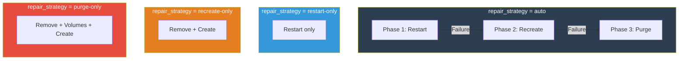
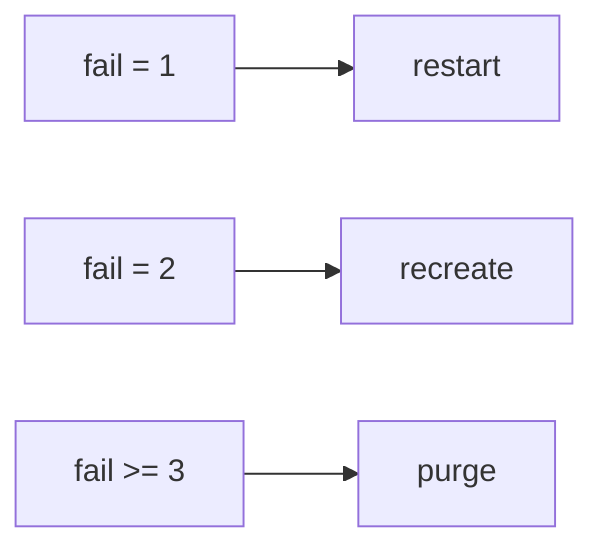
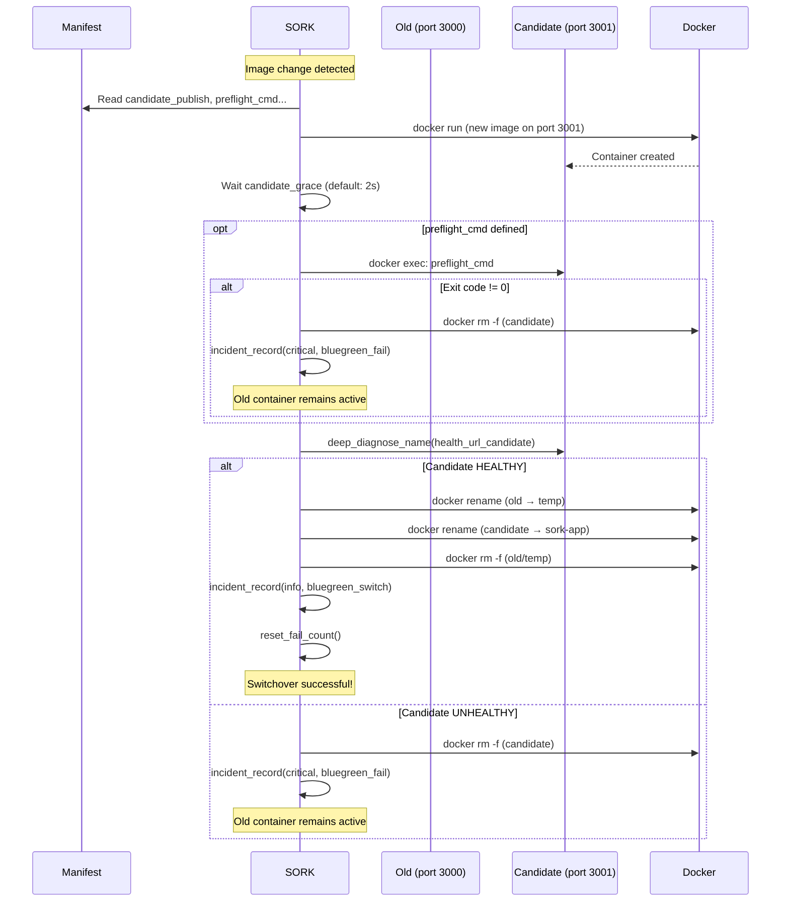
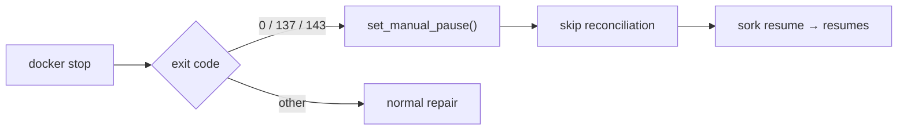
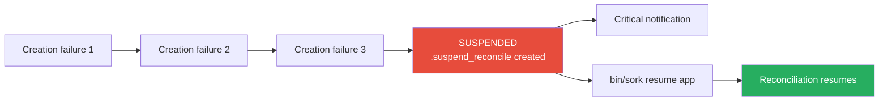

# Repair & Rollout

The `repair.sh` module implements automatic repair through escalation and deployment strategies (recreate, blue/green).

---

## Repair Strategies

### Overview



### Phase 1: Restart

```bash
docker restart sork-<app>
```

- Simple and fast
- Preserves volumes, config, and the container filesystem
- Sufficient for temporary crashes and mild memory leaks

### Phase 2: Recreate

```bash
docker rm -f sork-<app>
docker run ... (full re-creation from the manifest)
```

- Regenerates the container from scratch using the image
- Applies the current manifest configuration (ports, env, volumes, labels...)
- Bind volumes are reattached
- Useful when the container filesystem is corrupted

### Phase 3: Purge

```bash
docker rm -f sork-<app>
docker volume rm <volumes>     # if purge_on_escalation=1
docker run ... (full re-creation)
```

- Last resort
- Removes named volumes to start from a clean slate
- **Potential data loss** if volumes are not backed up

### Configuration

```ini
[mon-service]
repair_strategy = auto           # Full escalation (default)
repair_strategy = restart-only   # Restart only
repair_strategy = recreate-only  # Recreate only
repair_strategy = purge-only     # Purge only

purge_on_escalation = 1          # Remove volumes during purge (default: 0)
post_repair_grace = 5            # Seconds to wait after repair (default: 3)
```

### `repair_execute()` Logic

The phase is determined by the `fail_count` failure counter:

**`auto` mode — escalation based on `fail_count`:**



Each phase calls `sork_audit_event()` and `incident_record()` after execution.

---

## Blue/Green Deployment

Blue/green deployment enables zero-downtime updates. A candidate container is created, validated, then switched over.

### Full Flow



### Complete Configuration

```ini
[mon-service]
image = myapp:v2.0.0                                      # New image
rollout_strategy = blue_green                              # Enable blue/green
publish = 127.0.0.1:3000:3000                              # Production port
candidate_publish = 127.0.0.1:3001:3000                    # Candidate temporary port (REQUIRED)
health_url = http://127.0.0.1:3000/health                  # Production health
health_url_candidate = http://127.0.0.1:3001/health        # Candidate health (optional)
preflight_cmd = python manage.py migrate                    # Pre-switch command (optional)
```

!!! warning "candidate_publish is required"
    If `rollout_strategy = blue_green` but `candidate_publish` is not defined, `bin/sork doctor` will report an error.

---

## Manual Pause

### Problem Solved

Without manual pause, an operator running `docker stop sork-web` would see SORK restart the service immediately on the next cycle.

### Operation



### Configuration

```ini
[mon-service]
manual_stop_pause = 1   # Enabled by default
manual_stop_pause = 0   # Disable: always restart
```

### Involved Functions

| Function | Description |
|---|---|
| `manual_pause_state_path(app)` | Flag file path |
| `is_manual_pause_active(app)` | Is the service paused? |
| `set_manual_pause(app, reason)` | Enable pause |
| `clear_manual_pause(app)` | Disable pause |
| `manual_stop_pause_enabled(app)` | Is pause configured? |
| `exit_code_looks_like_manual_stop(code)` | Exit code = manual stop? |

---

## Config Version

To force container re-creation without changing the image:

```ini
[mon-service]
config_version = 2   # Increment this value
```

SORK compares the `sork.config_version` label of the container with the manifest value. If they differ, the container is recreated (or deployed via blue/green depending on the strategy).

The `desired_config_version()` and `current_config_version()` functions handle this comparison.

---

## Automatic Suspension

```ini
[mon-service]
create_fail_max_attempts = 3   # 0 = unlimited (default)
```



The `sork_clear_suspend_state()` function removes suspension files and resets the counter to zero.

---

## repair.sh Module Functions

| Function | Description |
|---|---|
| `reconcile_app(app)` | Main entry point for per-service reconciliation |
| `ensure_desired_revision(app)` | Check image and config_version, trigger rollout if needed |
| `rollout_blue_green(app)` | Complete blue/green deployment |
| `repair_execute(app, reason)` | Repair escalation (restart → recreate → purge) |
| `candidate_preflight(app, cname)` | Execute preflight command in the candidate |
| `create_candidate_name(app)` | Generate candidate container name |
| `detect_unexpected_restart(app)` | Compare restart count with saved state |
| `remove_orphan_containers()` | Remove undeclared sork-* containers |
| `sork_section_reserved(section)` | Check if a section is reserved |
| `is_manual_pause_active(app)` | Check manual pause |
| `set_manual_pause(app, reason)` | Enable pause |
| `clear_manual_pause(app)` | Disable pause |
