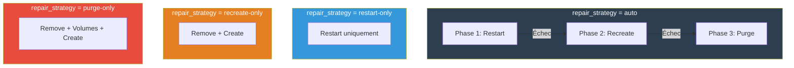
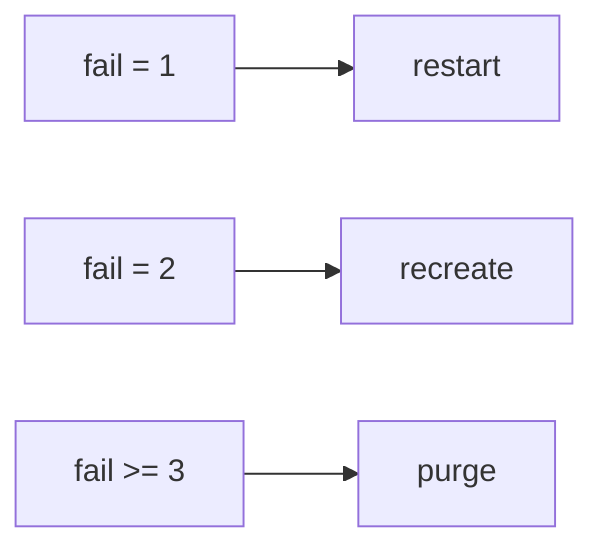
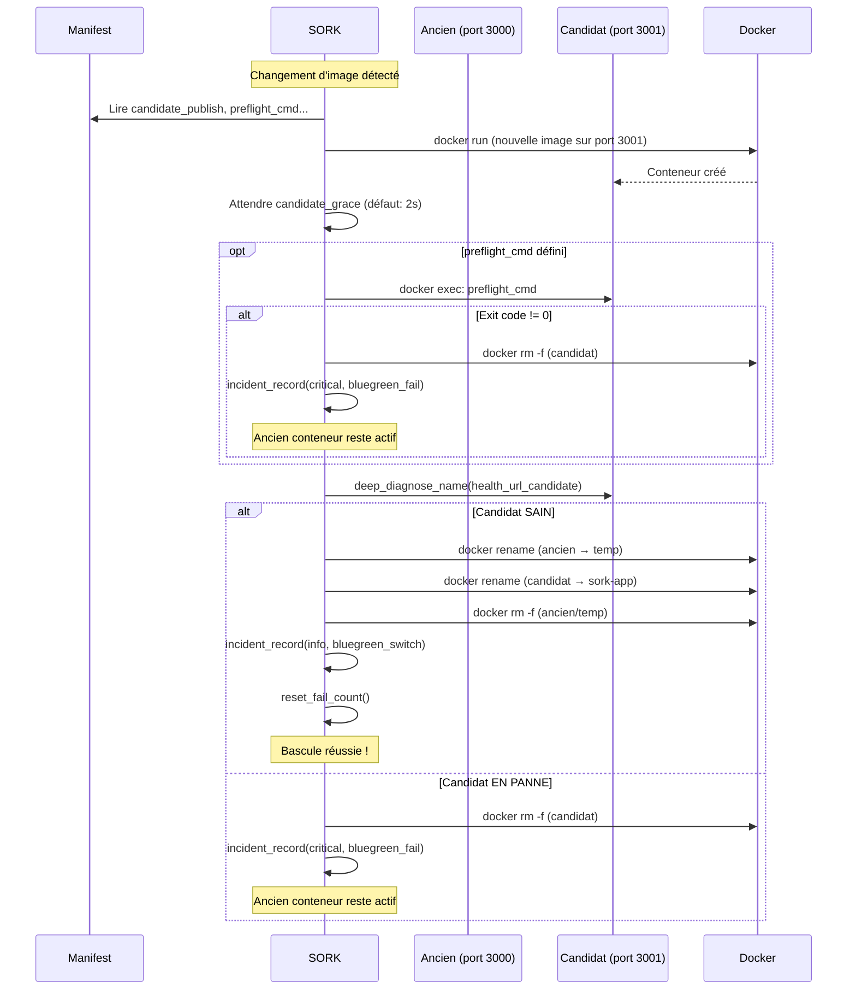
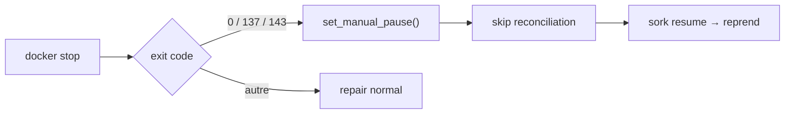

# Repair & Rollout

Le module `repair.sh` implémente la réparation automatique par escalade et les stratégies de déploiement (recreate, blue/green).

---

## Stratégies de réparation

### Vue d'ensemble



### Phase 1 : Restart

```bash
docker restart sork-<app>
```

- Simple et rapide
- Conserve les volumes, la config, le filesystem du conteneur
- Suffisant pour les crashs temporaires et les fuites mémoire légères

### Phase 2 : Recreate

```bash
docker rm -f sork-<app>
docker run ... (re-création complète depuis le manifest)
```

- Régénère le conteneur depuis zéro à partir de l'image
- Applique la configuration actuelle du manifest (ports, env, volumes, labels...)
- Les volumes bind sont réattachés
- Utile quand le filesystem du conteneur est corrompu

### Phase 3 : Purge

```bash
docker rm -f sork-<app>
docker volume rm <volumes>     # si purge_on_escalation=1
docker run ... (re-création complète)
```

- Dernier recours
- Supprime les volumes nommés pour repartir d'une base propre
- **Perte de données possible** si les volumes ne sont pas sauvegardés

### Configuration

```ini
[mon-service]
repair_strategy = auto           # Escalade complète (défaut)
repair_strategy = restart-only   # Seulement restart
repair_strategy = recreate-only  # Seulement recreate
repair_strategy = purge-only     # Seulement purge

purge_on_escalation = 1          # Supprimer les volumes lors du purge (défaut: 0)
post_repair_grace = 5            # Secondes d'attente après réparation (défaut: 3)
```

### Logique de `repair_execute()`

La phase est déterminée par le compteur d'échecs `fail_count` :

**Mode `auto` — escalade selon `fail_count` :**



Chaque phase appelle `sork_audit_event()` et `incident_record()` après exécution.

---

## Déploiement Blue/Green

Le déploiement blue/green permet des mises à jour zero-downtime. Un conteneur candidat est créé, validé, puis basculé.

### Flux complet



### Configuration complète

```ini
[mon-service]
image = myapp:v2.0.0                                      # Nouvelle image
rollout_strategy = blue_green                              # Activer blue/green
publish = 127.0.0.1:3000:3000                              # Port de production
candidate_publish = 127.0.0.1:3001:3000                    # Port temporaire du candidat (REQUIS)
health_url = http://127.0.0.1:3000/health                  # Santé de la production
health_url_candidate = http://127.0.0.1:3001/health        # Santé du candidat (optionnel)
preflight_cmd = python manage.py migrate                    # Commande pré-bascule (optionnel)
```

!!! warning "candidate_publish est obligatoire"
    Si `rollout_strategy = blue_green` mais que `candidate_publish` n'est pas défini, `bin/sork doctor` signalera une erreur.

---

## Pause manuelle

### Problème résolu

Sans pause manuelle, un opérateur qui fait `docker stop sork-web` verrait SORK redémarrer le service immédiatement au prochain cycle.

### Fonctionnement



### Configuration

```ini
[mon-service]
manual_stop_pause = 1   # Activé par défaut
manual_stop_pause = 0   # Désactiver : toujours redémarrer
```

### Fonctions impliquées

| Fonction | Description |
|---|---|
| `manual_pause_state_path(app)` | Chemin du fichier flag |
| `is_manual_pause_active(app)` | Le service est-il en pause ? |
| `set_manual_pause(app, reason)` | Activer la pause |
| `clear_manual_pause(app)` | Désactiver la pause |
| `manual_stop_pause_enabled(app)` | La pause est-elle configurée ? |
| `exit_code_looks_like_manual_stop(code)` | Exit code = arrêt manuel ? |

---

## Config version

Pour forcer la re-création d'un conteneur sans changer l'image :

```ini
[mon-service]
config_version = 2   # Incrémenter cette valeur
```

SORK compare le label `sork.config_version` du conteneur avec la valeur du manifest. Si elles diffèrent, le conteneur est recréé (ou déployé en blue/green selon la stratégie).

Les fonctions `desired_config_version()` et `current_config_version()` gèrent cette comparaison.

---

## Suspension automatique

```ini
[mon-service]
create_fail_max_attempts = 3   # 0 = illimité (défaut)
```


La fonction `sork_clear_suspend_state()` supprime les fichiers de suspension et remet le compteur à zéro.

---

## Fonctions du module repair.sh

| Fonction | Description |
|---|---|
| `reconcile_app(app)` | Point d'entrée principal de la réconciliation par service |
| `ensure_desired_revision(app)` | Vérifie image et config_version, déclenche rollout si nécessaire |
| `rollout_blue_green(app)` | Déploiement blue/green complet |
| `repair_execute(app, reason)` | Escalade de réparation (restart → recreate → purge) |
| `candidate_preflight(app, cname)` | Exécute la commande preflight dans le candidat |
| `create_candidate_name(app)` | Génère le nom du conteneur candidat |
| `detect_unexpected_restart(app)` | Compare le restart count avec l'état sauvegardé |
| `remove_orphan_containers()` | Supprime les conteneurs sork-* non déclarés |
| `sork_section_reserved(section)` | Vérifie si une section est réservée |
| `is_manual_pause_active(app)` | Vérifie la pause manuelle |
| `set_manual_pause(app, reason)` | Active la pause |
| `clear_manual_pause(app)` | Désactive la pause |
