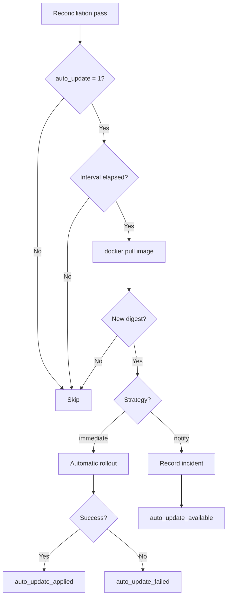

# Automatic Updates

The automatic update module (`lib/update.sh`) periodically checks whether new versions of Docker images are available in the registry, and can apply them automatically.

## How It Works

On each reconciliation pass, SORK checks for each service with `auto_update = 1`:

1. **Interval check** -- has the configured delay (`auto_update_interval`) elapsed since the last check?
2. **Image pull** -- `docker pull` to fetch the latest remote digest
3. **Digest comparison** -- is the remote digest different from the stored local digest?
4. **Strategy application** -- based on `auto_update_strategy`:
   - `immediate`: applies the rollout immediately (uses the service's `rollout_strategy`: `recreate` or `blue_green`)
   - `notify`: records an informational incident without touching the container



## Configuration

Keys to add in the service section of `manifest.ini`:

| Key | Type | Default | Description |
|---|---|---|---|
| `auto_update` | bool | `0` | Enable automatic update checking |
| `auto_update_interval` | string | `86400` | Interval between checks. Accepts seconds or: `hourly` (3600s), `daily` (86400s), `weekly` (604800s) |
| `auto_update_strategy` | string | `immediate` | Application strategy: `immediate` (apply automatically) or `notify` (alert only) |

The rollout strategy used during application depends on `rollout_strategy` (`recreate` or `blue_green`).

## Example

```ini
[my-app]
image = myapp:latest
auto_update = 1
auto_update_interval = daily
auto_update_strategy = immediate
rollout_strategy = blue_green
candidate_publish = 127.0.0.1:3001:3000
```

With this configuration, SORK checks once a day whether `myapp:latest` has a new digest. If so, it performs an automatic blue/green rollout.

### Notify mode

```ini
[my-app]
image = myapp:latest
auto_update = 1
auto_update_interval = hourly
auto_update_strategy = notify
```

SORK checks every hour and records an `auto_update_available` incident if an update is detected. The update can then be triggered manually via the UI or API.

## Manual Application

When an update is pending (notify mode), it can be applied:

- **Via the API**: `POST /api/update/apply/{name}`
- **Via the UI**: from the orchestrator Services page

## Events and Notifications

| Event | Severity | Description |
|---|---|---|
| `auto_update_available` | `info` | New image detected (notify mode) |
| `auto_update_apply` | `info` | Update being applied |
| `auto_update_applied` | `ok` | Update applied successfully |
| `auto_update_failed` | `warn` | Update rollout failed |

These events are sent to all configured notification channels (Discord, Slack, Teams, Telegram, SMTP).

## State Files

| File | Content |
|---|---|
| `.sork/state/update_check_ts.<app>` | Timestamp of last check |
| `.sork/state/update_digest.<app>` | Last known image digest |
| `.sork/state/update_available.<app>` | Pending update marker (notify mode) |

## Functions (lib/update.sh)

| Function | Description |
|---|---|
| `auto_update_enabled` | Check if auto-update is enabled for a service |
| `auto_update_interval` | Return the interval in seconds |
| `update_check_app` | Check and apply updates for a service |
| `update_check_all` | Check all services (called in the reconciliation loop) |
| `update_available` | Return true if an update is pending |
| `update_apply_pending` | Manually apply a pending update |
