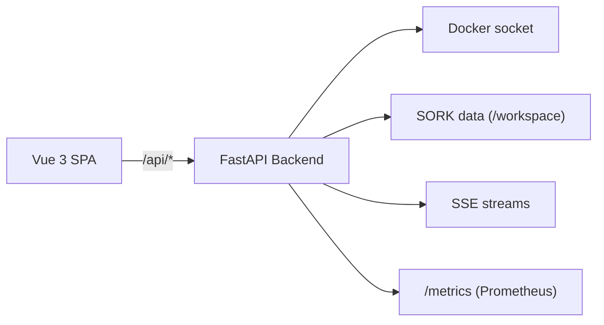

# Web Console

Web-based management and monitoring interface, built with FastAPI (REST backend + SSE) and Vue 3 (TypeScript SPA).

---

## Architecture



### Tech Stack

| Component | Technology | Version |
|---|---|---|
| Backend | Python / FastAPI | 3.12+ |
| Frontend | Vue 3 + TypeScript + Vite | 3.x |
| Styling | Tailwind CSS | 3.x |
| Icons | Lucide | — |
| State management | Pinia | — |
| Container | Docker multi-stage | Node 20 + Python 3.12 Alpine |

---

## Getting Started

### Via Docker (production)

```bash
./scripts/deploy-ui.sh
```

The UI is accessible at `http://localhost:18100`.

For LAN access:

```bash
SORK_UI_PUBLISH_BIND=0.0.0.0 ./scripts/deploy-ui.sh
```

### Local Development

=== "Backend"

    ```bash
    cd ui/backend
    pip install -r requirements.txt
    uvicorn app.main:app --reload --port 8080
    ```

=== "Frontend"

    ```bash
    cd ui/frontend
    npm install
    npm run dev
    # → http://localhost:5173 (proxies /api to the backend)
    ```

---

## Authentication

Authentication is **mandatory**. SORK uses a multi-user system with JWT and two roles (`admin` / `technicien`).

On first launch, an `admin` / `admin` account is automatically created. The interface forces a password change for the default account.

### API Login

```bash
# 1. Get a JWT token
curl -X POST http://localhost:8080/api/auth/login \
  -H "Content-Type: application/json" \
  -d '{"username": "admin", "password": "your_password"}'

# 2. Use the token
curl -H "Authorization: Bearer eyJ..." http://localhost:8080/api/containers/
```

For SSE streams (EventSource cannot set headers):

```bash
curl http://localhost:8080/api/stream?token=eyJ...
```

See [Configuration > Authentication](../configuration/authentication.en.md) for full details (roles, security, user API).

---

## Interface Sections

### Dashboard

Overview of your infrastructure:

- **Daemon status**: indicator based on heartbeat (active, inactive, unknown)
- **Service grid**: card for each service with state, uptime, quick actions
- **System metrics**: host server CPU, memory, disk
- **Recent alerts**: latest unacknowledged notifications

### Docker

Direct management of all Docker resources:

| Subsection | Features |
|---|---|
| **Containers** | List, creation (multi-step wizard), start/stop/restart, logs, exec, stats, export, commit |
| **Images** | List, pull, build, remove, prune, registry search |
| **Volumes** | List, create, remove, prune |
| **Networks** | List, create, remove, connect/disconnect |
| **Stacks** | Docker Compose management (deploy, down, status) |
| **System Info** | Docker version, storage driver, resources |
| **Events** | Real-time Docker events stream (SSE) |

### Orchestrator

SORK-specific interface:

| Subsection | Features |
|---|---|
| **Services** | Detailed state, actions (start/stop/restart), resume |
| **Manifest Editor** | Syntax-aware INI file editing with validation |
| **Autoscale Dashboard** | Metrics, replicas, thresholds, manual scale, stress test |
| **Incidents** | Filterable history by date/service/severity, acknowledgment |
| **Audit Journal** | Container operation timeline with filtering |

### AppStore

Simplified deployment via preconfigured templates:

- Built-in template catalog
- Remote template sources
- Multi-step deployment assistant (WizardModal)

### Logs

Centralized log viewer:

- SORK daemon logs (formatted JSON)
- Container logs (with real-time streaming)
- UI backend logs
- Log search

### Settings

- User management (admin only)
- Notification management (Discord config)
- Display preferences

---

## Mounted Volumes

The UI container requires two volumes:

| Host Volume | Container Target | Usage |
|---|---|---|
| SORK project root | `/workspace` | Access to manifest, state, logs, bin/sork |
| `/var/run/docker.sock` | `/var/run/docker.sock` | Communication with the Docker daemon |

---

## UI Environment Variables

| Variable | Default | Description |
|---|---|---|
| `PORT` | `8080` | Backend listen port |
| `SORK_UI_BIND` | `0.0.0.0` | Bind address |
| `SORK_ADMIN_PASSWORD` | `admin` | Initial admin account password |
| `SORK_JWT_SECRET` | (auto) | JWT signing key (auto-generated if absent) |
| `SORK_JWT_EXPIRE_MINUTES` | `480` | JWT token validity duration (minutes) |
| `SORK_RUNTIME` | (auto) | `docker` or `podman` |
| `SORK_UI_TLS_CERT` | — | TLS certificate path |
| `SORK_UI_TLS_KEY` | — | TLS key path |
| `SORK_METRICS_PROTECT` | `0` | Protect /metrics with authentication |
| `SORK_UI_VERBOSE` | `0` | Detailed HTTP logs |

---

## Frontend Components

| Component | Description |
|---|---|
| `DataTable` | Table with sorting, filtering, pagination |
| `StatusBadge` | Colored badge (running, stopped, unhealthy) |
| `JsonViewer` | Formatted JSON display |
| `ConfirmModal` | Confirmation dialog for destructive actions |
| `FeedbackToast` | Temporary notification (success, error, info) |
| `DeployProgress` | Deployment progress bar |
| `WizardModal` | Multi-step assistant |
| `ArrayField` | Form field for lists (ports, volumes, env) |
| `ContainerWizard` | Complete container creation form |
