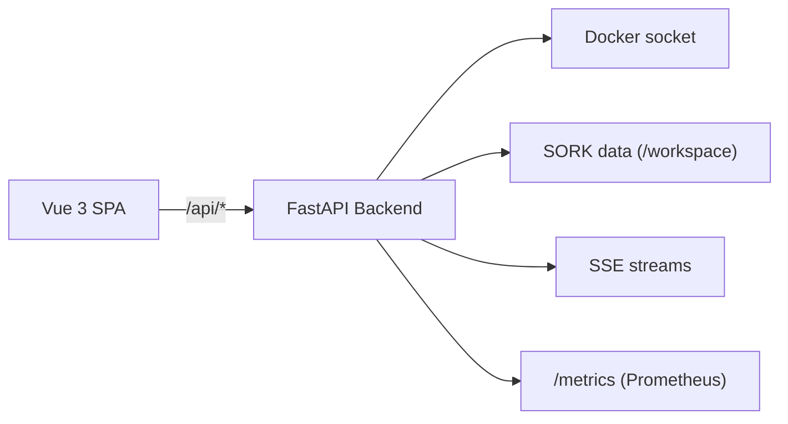

# Console Web

Interface web de gestion et de monitoring, construite avec FastAPI (backend REST + SSE) et Vue 3 (SPA TypeScript).

---

## Architecture



### Stack technique

| Composant | Technologie | Version |
|---|---|---|
| Backend | Python / FastAPI | 3.12+ |
| Frontend | Vue 3 + TypeScript + Vite | 3.x |
| Style | Tailwind CSS | 3.x |
| Icônes | Lucide | — |
| State management | Pinia | — |
| Conteneur | Docker multi-stage | Node 20 + Python 3.12 Alpine |

---

## Démarrage

### Via Docker (production)

```bash
./scripts/deploy-ui.sh
```

L'UI est accessible sur `http://localhost:18100`.

Pour un accès LAN :

```bash
SORK_UI_PUBLISH_BIND=0.0.0.0 ./scripts/deploy-ui.sh
```

### Développement local

=== "Backend"

    ```bash
    cd ui/backend
    pip install -r requirements.txt
    uvicorn app.main:app --reload --port 8080
    ```

=== "Frontend"

    ```bash
    cd ui/frontend
    npm install
    npm run dev
    # → http://localhost:5173 (proxifié /api vers le backend)
    ```

---

## Authentification

L'authentification est **obligatoire**. SORK utilise un systeme multi-utilisateurs avec JWT et deux roles (`admin` / `technicien`).

Au premier lancement, un compte `admin` / `admin` est créé automatiquement. L'interface force le changement du mot de passe par défaut.

### Connexion API

```bash
# 1. Obtenir un token JWT
curl -X POST http://localhost:8080/api/auth/login \
  -H "Content-Type: application/json" \
  -d '{"username": "admin", "password": "votre_mot_de_passe"}'

# 2. Utiliser le token
curl -H "Authorization: Bearer eyJ..." http://localhost:8080/api/containers/
```

Pour les flux SSE (EventSource ne supporte pas les headers) :

```bash
curl http://localhost:8080/api/stream?token=eyJ...
```

Voir [Configuration > Authentification](../configuration/authentication.md) pour les details complets (roles, securite, API utilisateurs).

---

## Sections de l'interface

### Dashboard

Vue d'ensemble de votre infrastructure :

- **Statut du daemon** : indicateur basé sur le heartbeat (actif, inactif, inconnu)
- **Grille de services** : carte de chaque service avec état, uptime, actions rapides
- **Métriques système** : CPU, mémoire, disque du serveur hôte
- **Alertes récentes** : dernières notifications non acquittées

### Docker

Gestion directe de toutes les ressources Docker :

| Sous-section | Fonctionnalités |
|---|---|
| **Containers** | Liste, création (wizard multi-étapes), start/stop/restart, logs, exec, stats, export, commit |
| **Images** | Liste, pull, build, suppression, prune, recherche registry |
| **Volumes** | Liste, création, suppression, prune |
| **Networks** | Liste, création, suppression, connect/disconnect |
| **Stacks** | Gestion Docker Compose (deploy, down, status) |
| **System Info** | Version Docker, storage driver, ressources |
| **Events** | Flux temps réel des événements Docker (SSE) |

### Orchestrator

Interface spécifique SORK :

| Sous-section | Fonctionnalités |
|---|---|
| **Services** | État détaillé, actions (start/stop/restart), resume |
| **Manifest Editor** | Édition syntaxique du fichier INI avec validation |
| **Autoscale Dashboard** | Métriques, replicas, seuils, scale manuel, stress test |
| **Incidents** | Historique filtrable par date/service/sévérité, acquittement |
| **Audit Journal** | Timeline des opérations conteneur avec filtrage |

### AppStore

Déploiement simplifié via templates préconfigurés :

- Catalogue de templates intégrés
- Sources de templates distantes
- Assistant de déploiement multi-étapes (WizardModal)

### Logs

Visionneuse centralisée :

- Logs daemon SORK (JSON formatté)
- Logs conteneurs (avec streaming temps réel)
- Logs backend UI
- Recherche dans les logs

### Settings

- Gestion des utilisateurs (admin uniquement)
- Gestion des notifications (config Discord)
- Préférences d'affichage

---

## Volumes montés

Le conteneur UI nécessite deux volumes :

| Volume hôte | Cible dans le conteneur | Usage |
|---|---|---|
| Racine du projet SORK | `/workspace` | Accès au manifest, state, logs, bin/sork |
| `/var/run/docker.sock` | `/var/run/docker.sock` | Communication avec le daemon Docker |

---

## Variables d'environnement de l'UI

| Variable | Défaut | Description |
|---|---|---|
| `PORT` | `8080` | Port d'écoute du backend |
| `SORK_UI_BIND` | `0.0.0.0` | Adresse de bind |
| `SORK_ADMIN_PASSWORD` | `admin` | Mot de passe initial du compte admin |
| `SORK_JWT_SECRET` | (auto) | Clé de signature JWT (auto-générée si absent) |
| `SORK_JWT_EXPIRE_MINUTES` | `480` | Durée de validité des tokens JWT (minutes) |
| `SORK_RUNTIME` | (auto) | `docker` ou `podman` |
| `SORK_UI_TLS_CERT` | — | Chemin certificat TLS |
| `SORK_UI_TLS_KEY` | — | Chemin clé TLS |
| `SORK_METRICS_PROTECT` | `0` | Protéger /metrics par authentification |
| `SORK_UI_VERBOSE` | `0` | Logs HTTP détaillés |

---

## Composants frontend

| Composant | Description |
|---|---|
| `DataTable` | Tableau avec tri, filtrage, pagination |
| `StatusBadge` | Badge coloré (running, stopped, unhealthy) |
| `JsonViewer` | Affichage JSON formatté |
| `ConfirmModal` | Dialogue de confirmation pour actions destructives |
| `FeedbackToast` | Notification temporaire (succès, erreur, info) |
| `DeployProgress` | Barre de progression déploiement |
| `WizardModal` | Assistant multi-étapes |
| `ArrayField` | Champ formulaire pour listes (ports, volumes, env) |
| `ContainerWizard` | Formulaire complet de création conteneur |
